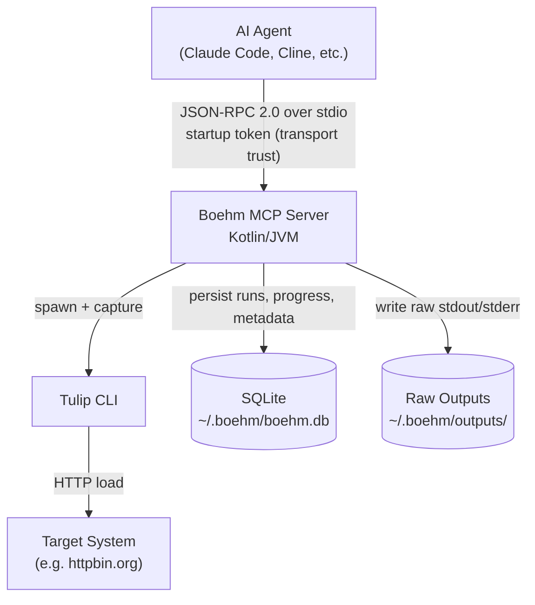
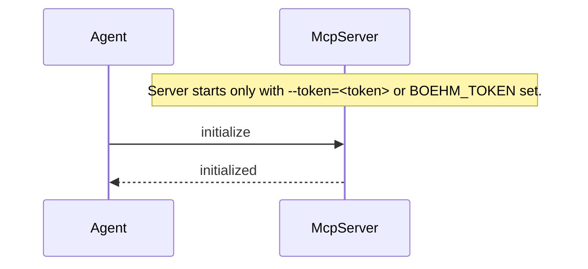
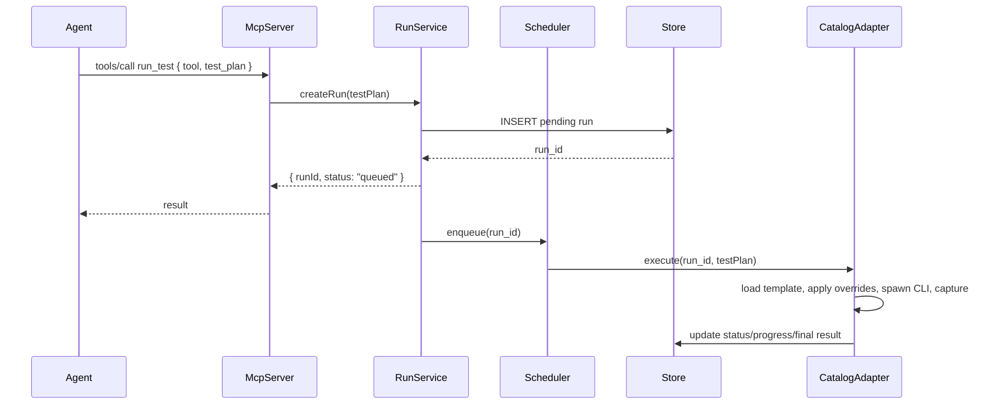
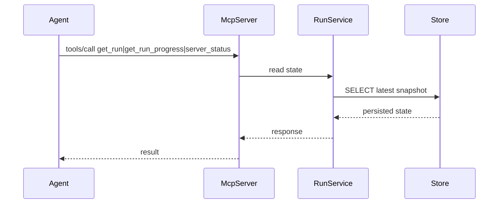

# Architecture — Phase 1 (revised)

## Review Summary

The original proposal is directionally correct, but it is still too optimistic for a first MCP server release. For Phase 1, the design should favor simplicity, durability, and predictable behavior over extensibility. The server must be reliable under the MCP stdio transport, survive process restarts, and avoid turning a small tool into a general-purpose execution platform.

The biggest design corrections are:

- Make execution asynchronous from the start. `run_test` should return quickly with a persisted run record, not block until the load test completes.
- Treat progress as durable state, not as a transient in-memory object. A stdio server can restart, and the agent may poll after a delay.
- Keep the adapter boundary narrow. The adapter should own process execution, output capture, and parsing; the rest of the system should only consume normalized state.
- Fail fast on invalid input and tool absence. A Phase 1 server should be explicit and predictable, not attempt to recover from every failure mode.

---

## System Context



---

## Core Design Principles

1. The MCP server is a request/response entrypoint, not the execution engine itself.
   - The stdio loop should accept requests, validate them, and hand off work to a background executor.
   - Tool calls should not block the event loop for long-running tests.

2. The authoritative source of truth is SQLite.
   - Runs, queue state, progress snapshots, and errors should be persisted.
   - In-memory state is only a cache.

3. The adapter boundary is intentionally small.
   - `PerfToolAdapter` should expose `validate`, `run`, and optionally a progress callback.
   - No other layer should need to know about Tulip-specific stdout formats.

4. Phase 1 should be opinionated and boring.
   - One adapter mechanism: catalog-driven `CatalogAdapter`.
   - One execution policy: serial execution.
   - One auth model: token required at startup; transport trust delegated to the spawner.

---

## Component Architecture

```mermaid
graph TB
    subgraph "Protocol Layer"
        McpServer["McpServer (MCP Kotlin SDK)<br/>initialize, tools/list, tools/call"]
        BoehmToolHandlers["BoehmToolHandlers.kt<br/>9 tool handlers"]
    end

    subgraph "Application Layer"
        Orchestrator["Orchestrator.kt<br/>route test plans, manage runs"]
        Scheduler["Scheduler.kt<br/>serial queue + worker"]
        Store["Store.kt<br/>SQLite CRUD"]
    end

    subgraph "Adapter Layer"
        AdapterInterface["PerfToolAdapter"]
        CatalogLoader["CatalogLoader.kt<br/>parse catalog.yaml"]
        CatalogAdapter["CatalogAdapter.kt<br/>template + overrides + exec"]
        TulipParser["TulipParser.kt<br/>native JSON → RunResult"]
    JMeterParser["JMeterParser.kt<br/>JTL CSV → RunResult"]
    K6Parser["K6Parser.kt<br/>k6 NDJSON → RunResult"]
    end

    subgraph "Catalog"
        CatalogYaml["catalog.yaml<br/>tool definitions + profiles"]
        Templates["profiles/&lt;tool&gt;/*<br/>config templates"]
    end

    subgraph "Model"
        Models["TestPlan, RunResult, ProgressEvent, Summary, Latency"]
    end

    Agent["AI Agent (MCP client)"]

    CatalogLoader --> CatalogYaml
    Agent --> McpServer
    McpServer --> BoehmToolHandlers
    BoehmToolHandlers --> Orchestrator
    Orchestrator --> Scheduler
    Orchestrator --> Store
    Scheduler --> CatalogAdapter
    CatalogAdapter --> CatalogLoader
    CatalogAdapter --> Templates
    CatalogAdapter --> TulipParser
    CatalogAdapter --> JMeterParser
    CatalogAdapter --> K6Parser
    CatalogAdapter --> Models
    TulipParser --> Models
    JMeterParser --> Models
    K6Parser --> Models
    Store --> SQLite[(SQLite)]
```



---

## Request Flow

### Initialize



### run_test



### get_run / get_run_progress / server_status



### History, baselines, comparison, cancellation

```mermaid
sequenceDiagram
    participant Agent
    participant McpServer
    participant Handlers
    participant Store

    Agent->>McpServer: tools/call list_runs { tool?, test_name?, limit? }
    McpServer->>Store: finished runs, newest first
    Agent->>McpServer: tools/call tag_baseline { run_id }
    McpServer->>Store: UPSERT baselines(scenario_id -> run_id)
    Agent->>McpServer: tools/call compare_runs { run_id, baseline_run_id? }
    McpServer->>Handlers: Comparator.compare(run, baseline)
    McpServer-->>Agent: per-metric deltas + regression/improvement flags
    Agent->>McpServer: tools/call cancel_run { run_id }
    alt queued/pending
        McpServer->>Store: status = cancelled (never executes)
    else running
        McpServer->>Store: kill subprocess tree; status = cancelled on return
    end
```

`compare_runs` is direction-aware: higher throughput is an improvement,
higher latency/error-rate a regression. Deltas beyond 10% are flagged.
Latency metrics include mean and stdev in every parser summary.

---

## State Model

The run lifecycle should be explicit and durable:

```text
pending -> queued -> running -> completed
                  \-> failed
                  \-> cancelled
```

Persisted fields for each run include:

- `id`
- `scenario_id` or equivalent name
- `tool`
- `status`
- `created_at`, `started_at`, `completed_at` (ISO-8601 everywhere, so lexicographic ordering works)
- `summary`
- `error`
- `raw_output_path`
- `metadata`

Progress (`progress_pct`, current stage, elapsed/remaining) is computed at query
time from `started_at` and the scenario's stored plan (warmup + duration), not
stored as a snapshot — so it stays accurate without background writers.

This is important because the server is stdio-based and may be restarted. A run should not depend on in-memory objects alone.

---

## Scheduler and Execution Model

A Phase 1 scheduler should be intentionally simple:

- One worker thread executes at a time.
- New runs are appended to a queue and marked `queued` immediately.
- The worker dequeues the next run and moves it to `running`.
- On completion, the worker updates the run record to `completed` or `failed`.

This meets the acceptance criteria without introducing premature parallelism or cross-run interference. A future phase can add isolation groups or concurrent workers, but Phase 1 should not try to optimize beyond serial execution.

---

## Adapter Contract

The adapter interface should be narrow and deterministic:

```kotlin
interface PerfToolAdapter {
    val name: String
    val profile: String
    val supportedTestTypes: List<TestType>
    val version: String
    val toolVersions: List<String>

    fun validate(testPlan: TestPlan): List<ValidationError>
    fun run(testPlan: TestPlan): RunResult

    /**
     * Runs the plan. Implementations that spawn a subprocess must invoke
     * [onProcessStart] once the process exists so the caller can cancel it.
     */
    fun run(testPlan: TestPlan, onProcessStart: (Process) -> Unit): RunResult = run(testPlan)
}
```

Only catalog profiles whose output schema has a registered parser get an
adapter instance (`buildAdapters` in `AdapterBuilder.kt`); unimplemented tools
(gatling, vegeta, wrk) stay out of the tool surface until parsers exist.

The adapter is responsible for:

- Loading the profile config template from `profiles/<tool>/`
- Applying overrides via JSON path (for JSON configs like Tulip) or copying as-is (for script-based tools like k6, JMeter, Gatling)
- Generating temporary config files and resolving output paths
- Constructing the CLI command from `catalog.yaml` with template variable substitution (`{{config_file}}`, `{{output_file}}`, `{{target_url}}`, etc.)
- Executing via `bash -c` to handle pipes, redirects, and command chaining
- Capturing stdout and reading output from the declared output path
- Parsing tool output into a normalized `RunResult` via a registered parser (`tulip-results`, `k6-jsonl`, etc.)

The rest of the system should not care which tool is being run — it consumes normalized `RunResult` objects from SQLite.

---

## Output and File Handling

The raw output path should be handled as a first-class concern:

- Write to a temporary file first.
- Rename to the final path only after the process completes successfully or when a failure is final.
- Store the final path in the run record.
- Preserve both stdout and stderr in the file for debugging.

This avoids partially written outputs and makes the integration test predictable.

---

## Authentication and Security

The Phase 1 auth model is intentionally simple:

- A token is required at startup (`--token=<token>` or `BOEHM_TOKEN`); the
  server refuses to start without one.
- stdio transport security is delegated to the spawning process — whoever can
  talk to the server's stdin is trusted (the spawner supplied the token).
- No per-request validation, role model, or token rotation in Phase 1.

The important design choice is that the server never runs without an explicit
token, so accidental unsandboxed starts are visible.

---

## Error Handling

Phase 1 should handle errors explicitly and consistently:

- Invalid input: return a validation error and do not create a run.
- Tool binary missing: mark the run as `failed` with a clear error.
- Timeout: kill the subprocess and record the failure with partial progress if available.
- Non-zero tool exit: record stderr and mark the run as `failed`.
- Internal failure: return MCP error `-32603` and log server-side details.

The server should avoid silently swallowing failures and should preserve enough context to debug the run later.

---

## Recommended Module Layout

```text
Boehm/
├── build.gradle.kts
├── catalog.yaml                     # Tool index: profiles, overrides, parsers
├── profiles/
│   ├── tulip/http-get.jsonc         # Tulip config template (JSONC)
│   ├── tulip/demo.jsonc
│   ├── k6/http-get.js               # k6 script template
│   ├── jmeter/http-get.jmx          # JMeter plan template
│   └── gatling/http-get.scala       # Gatling simulation template
├── src/
│   ├── main/kotlin/io/boehm/
│   │   ├── Main.kt                  # Entry point: stdio + catalog loader + 9 tool registrations
│   │   ├── catalog/
│   │   │   ├── CatalogModels.kt     # Catalog YAML data classes
│   │   │   ├── CatalogLoader.kt     # Parse catalog.yaml
│   │   │   ├── AdapterBuilder.kt    # Build adapters only for parser-backed schemas
│   │   │   └── CatalogAdapter.kt    # Generic PerfToolAdapter
│   │   ├── core/
│   │   │   ├── BoehmToolHandlers.kt  # MCP tool handlers (suspend funs)
│   │   │   ├── Comparator.kt         # Direction-aware baseline comparison
│   │   │   ├── Orchestrator.kt       # Test plan routing, run lifecycle, cancel routing
│   │   │   ├── Scheduler.kt          # Serial run queue + subprocess cancellation
│   │   │   └── Store.kt              # SQLite operations (runs, scenarios, baselines)
│   │   ├── model/
│   │   │   ├── TestPlan.kt          # Input: how to run a test
│   │   │   ├── RunResult.kt         # Output: normalized result + summary
│   │   │   └── ProgressEvent.kt     # Progress, events, enums
│   │   └── adapters/
│   │       ├── PerfToolAdapter.kt   # Interface all adapters implement
│   │       ├── tulip/
│   │       │   └── TulipParser.kt    # Parse Tulip JSON → RunResult
│   │       ├── jmeter/
│   │       │   └── JMeterParser.kt   # Parse JMeter JTL CSV → RunResult
│   │       └── k6/
│   │           └── K6Parser.kt       # Parse k6 NDJSON → RunResult
│   └── test/kotlin/io/boehm/
│       ├── adapter/
│       │   ├── TulipAdapterTest.kt  # Tests CatalogAdapter via tulip profile
│       │   ├── TulipParserTest.kt
│       │   ├── JMeterParserTest.kt
│       │   └── K6ParserTest.kt
│       ├── catalog/
│       │   ├── AdapterBuilderTest.kt
│       │   └── CatalogLoaderTest.kt
│       ├── core/
│       │   ├── BoehmServerTest.kt
│       │   ├── ComparatorTest.kt
│       │   ├── OrchestratorTest.kt
│       │   ├── SchedulerTest.kt
│       │   └── StoreTest.kt
│       ├── model/
│       │   └── RunResultTest.kt
│       ├── fixtures/
│       │   ├── mock-tulip.sh
│       │   ├── run-real-tulip.sh
│       │   ├── tulip-sample-output.json
│       │   └── jmeter-sample-output.csv
│       └── integration/
│           ├── TulipIntegrationTest.kt
│           └── JMeterIntegrationTest.kt
```

---

## What This Design Improves Over the First Draft

- It avoids making the MCP server itself the place where long-running execution and polling logic become too coupled.
- It makes progress observable even if the process or server restarts.
- It keeps the adapter interface stable while still allowing Tulip-specific parsing to remain isolated.
- It aligns the architecture with the Phase 1 acceptance criteria rather than overreaching into later phases.

## Risks to Keep in Mind

- Tulip may not provide a perfectly stable progress stream. For Phase 1, progress should be treated as best-effort and degraded gracefully.
- The server must never block the stdio loop for a long-running test. That is a hard requirement for a usable MCP implementation.
- The design should stay small. The temptation to add multi-user auth, generic plugin discovery, or parallel runners should be resisted until Phase 2.
