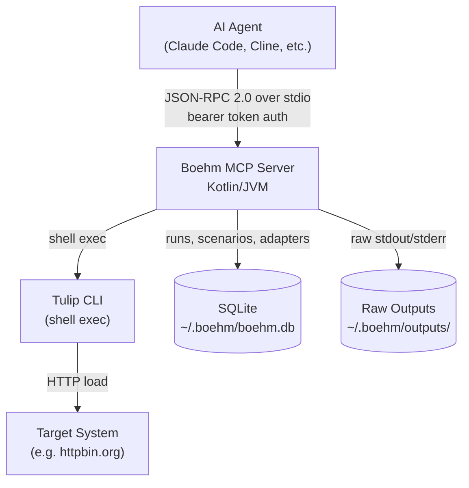
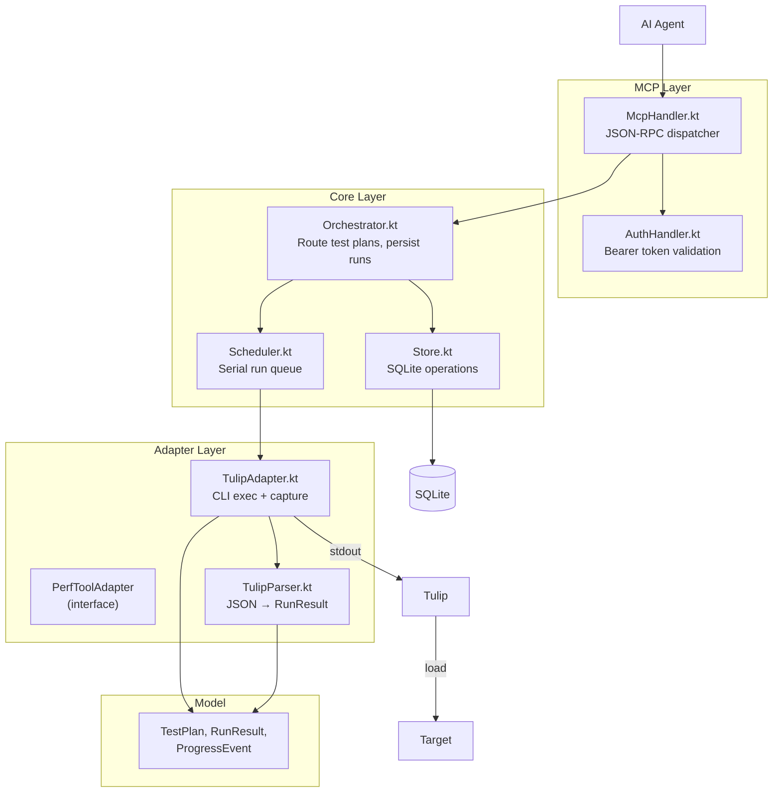
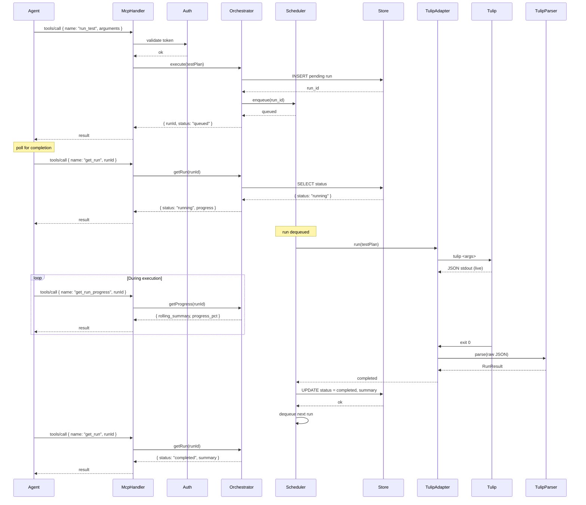
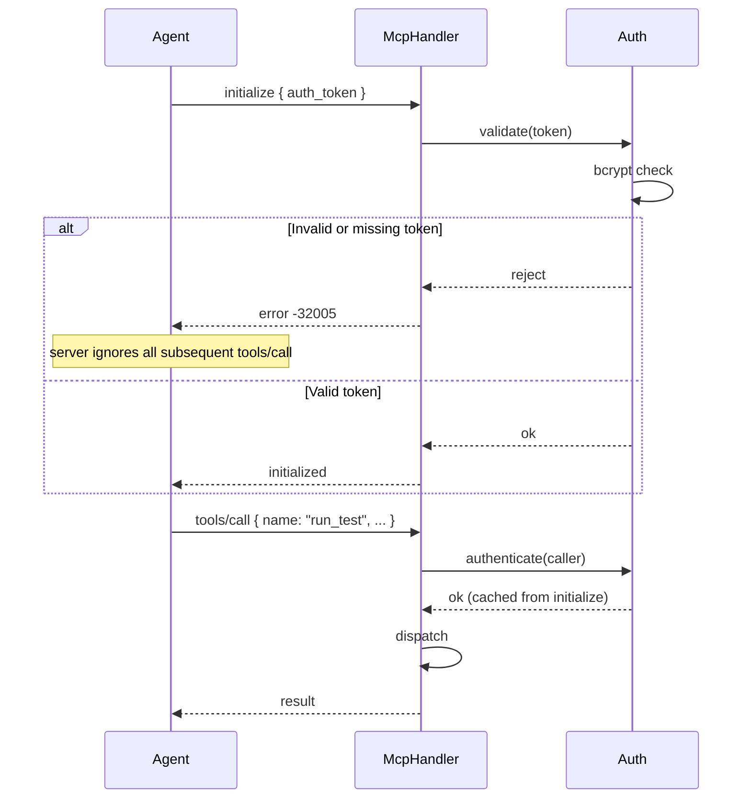
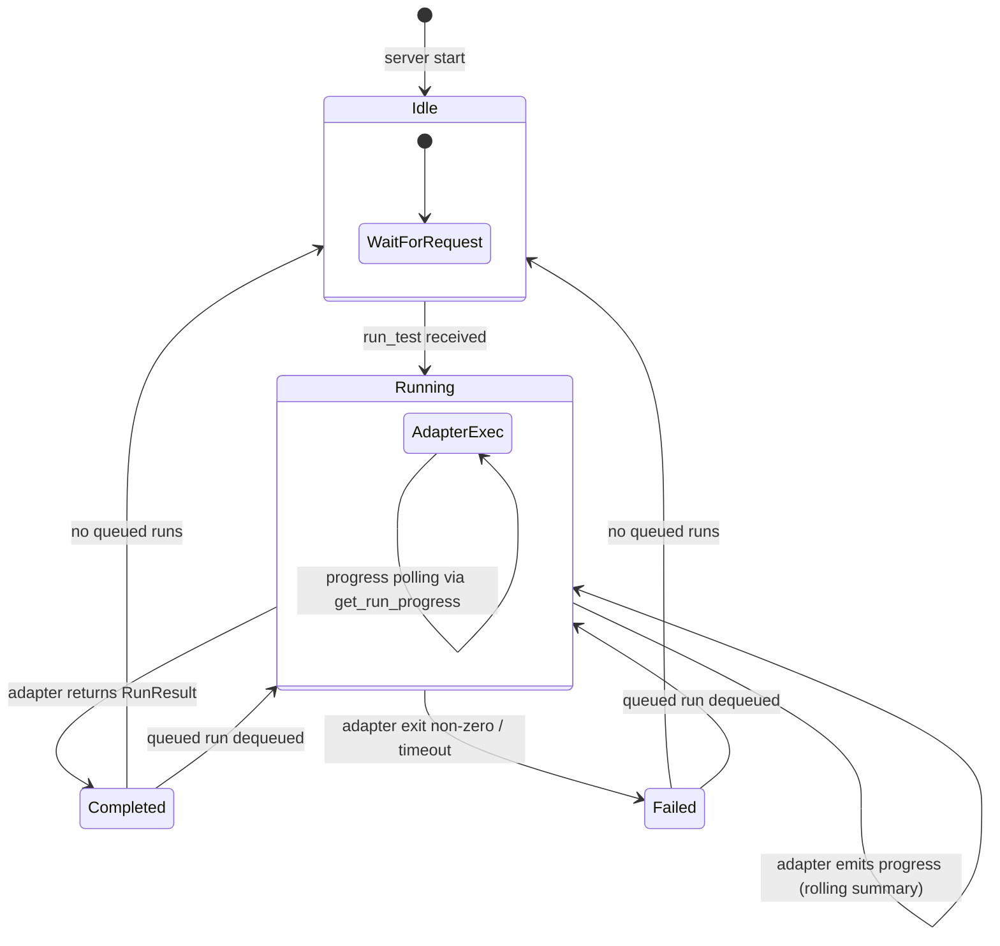
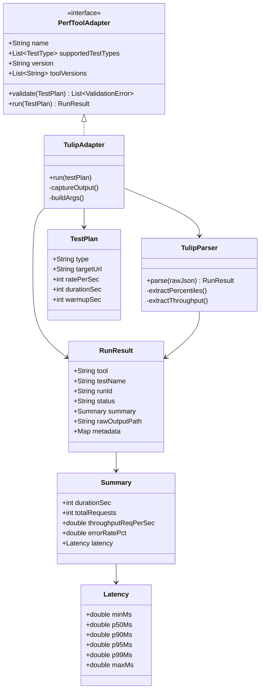

# Architecture — Phase 1

## System Context



---

## Component Architecture



---

## Data Flow — run_test



---

## Auth Flow



---

## Scheduler — Run Queue



---

## Adapter Interface



---

## Module Layout

```
Boehm/
├── build.gradle.kts              # Gradle config + dependencies
├── settings.gradle.kts
├── src/
│   └── main/kotlin/io/boehm/
│       ├── Main.kt               # Entry point: stdio JSON-RPC loop
│       ├── auth/
│       │   └── AuthHandler.kt    # Bearer token validation (bcrypt)
│       ├── core/
│       │   ├── McpHandler.kt     # JSON-RPC dispatcher → tools
│       │   ├── Orchestrator.kt   # Route test plans, persist runs
│       │   ├── Scheduler.kt      # Run queue, serial execution
│       │   └── Store.kt          # SQLite operations
│       ├── model/
│       │   ├── TestPlan.kt       # Test plan data class
│       │   ├── RunResult.kt      # Normalized result + summary + latency
│       │   └── ProgressEvent.kt  # Live progress event
│       └── adapters/
│           ├── PerfToolAdapter.kt  # Interface
│           └── tulip/
│               ├── TulipAdapter.kt  # CLI exec, output capture
│               └── TulipParser.kt   # Parse native JSON → RunResult
```

---

## Architectural Decision Records

### ADR-001: SQLite over JSON files

**Status:** Accepted
**Context:** Need persistence for runs, scenarios, and orchestration state. JSON files are simple but lack schema enforcement, concurrent writer support, and querying.
**Decision:** Use SQLite single-file database. Atomic writes, concurrent readers, schema enforcement, rich queries via SQL.
**Consequences:** Adequate for thousands of runs. If scale exceeds 100 runs/hour sustained, migrate to PostgreSQL via abstracted `Store` interface.

### ADR-002: All adapters are CLI shell exec

**Status:** Accepted
**Context:** Tulip could be called in-process (same JVM) for performance. This creates tight coupling to Tulip's internal APIs and JVM dependency conflicts.
**Decision:** All tool adapters shell out to the tool's CLI. The CLI output format is the stable contract. No in-process tool coupling.
**Consequences:** Consistent adapter pattern across all tools. Slight overhead from process spawn. Tulip may need a `--json` flag for machine-readable output.

### ADR-003: Serial execution by default

**Status:** Accepted
**Context:** Overlapping performance tests add noise to measurements (resource contention, JVM warmup, network interference).
**Decision:** Single global run queue. One test executes at a time. Additional runs are enqueued with status `queued`.
**Consequences:** Clean measurements. CI bottleneck for orgs with many concurrent PRs — mitigated by `isolation_group` opt-in parallelism in Phase 2.

### ADR-004: Bearer token auth in initialize handshake

**Status:** Accepted
**Context:** MCP protocol has no built-in auth. Need to prevent unauthorized access to the server.
**Decision:** Pass bearer token in `initialize` params. Validate on every `tools/call`. Server returns `-32005` on invalid/missing token.
**Consequences:** Simple, stateless auth. Token is sent once per connection. No session management needed in Phase 1.

### ADR-005: Normalized RunResult over raw tool output for analysis

**Status:** Accepted
**Context:** Each tool produces different output (JSON, CSV, HTML). Cross-tool comparison and historical tracking need a consistent schema.
**Decision:** Every adapter parses tool output into the normalized `RunResult` schema. Raw output preserved at `rawOutputPath` for debugging.
**Consequences:** Cross-tool comparison and trend analysis work on normalized fields. Tool-specific data goes in `metadata`. Raw output is available but not required for analytics.
