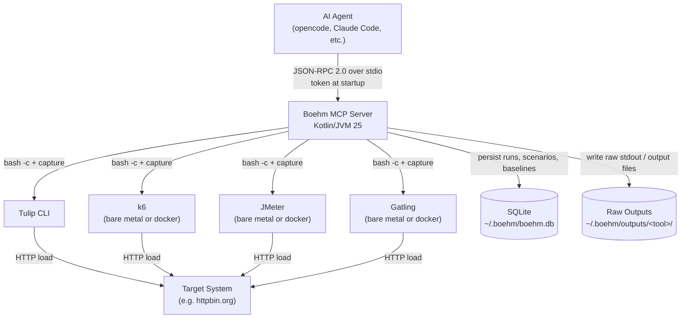
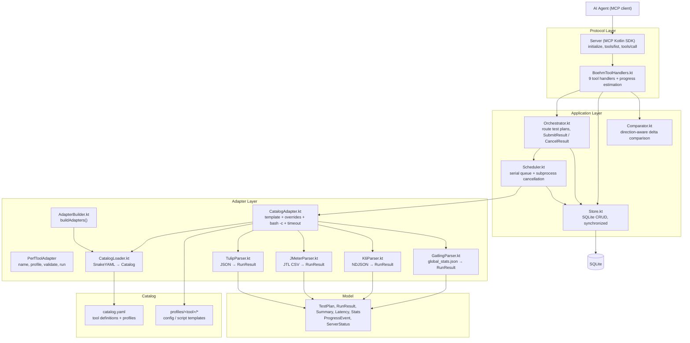
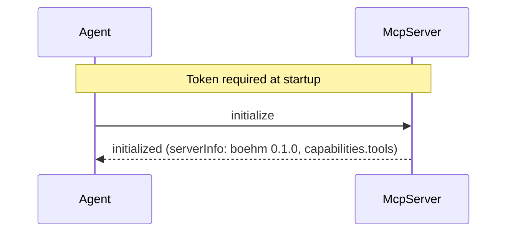
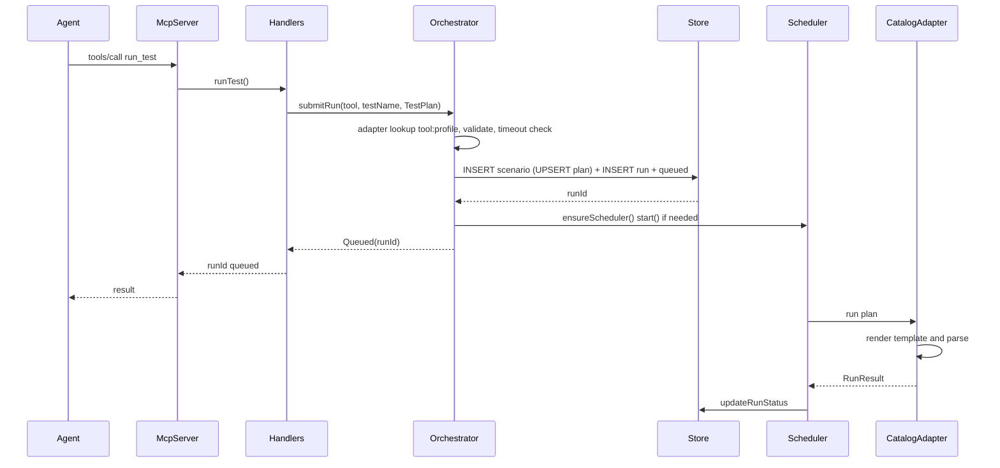
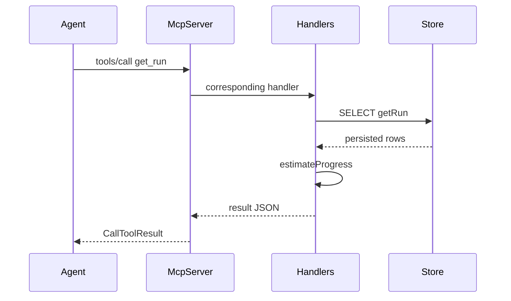
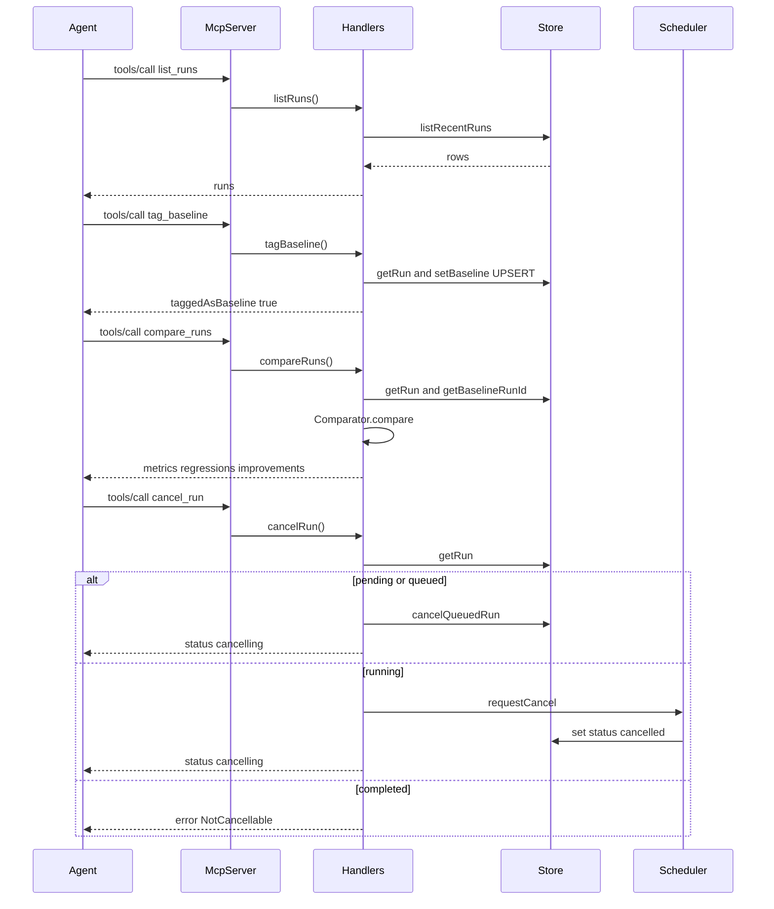

# Architecture — Boehm

Boehm is a Kotlin/JVM MCP server that runs performance tests via external CLI tools, normalizes results, and persists them in SQLite. All tool invocation is catalog-driven through a single generic adapter (`CatalogAdapter`). The server speaks JSON-RPC 2.0 over stdio via the official MCP Kotlin SDK (`io.modelcontextprotocol:kotlin-sdk:0.15.0`).

## System Context



## Core Design Principles

1. **MCP server is the entrypoint, not the execution engine.** `run_test` validates, persists a `queued` run, and returns immediately. A background scheduler serially executes runs so the stdio loop never blocks.
2. **SQLite is the source of truth.** Runs, queue state, baselines, and errors are persisted. In-memory state is a cache. The DB path is configurable via `BOEHM_DB_PATH` (`~/.boehm/boehm.db` default, `BOEHM_CATALOG_PATH` for the catalog).
3. **Adapter boundary is narrow.** `PerfToolAdapter` exposes `validate` and `run` (with an optional `onProcessStart` callback for cancellation). All tool-specific work (template rendering, command substitution, parsing) lives behind that interface.
4. **Catalog-driven.** Every tool and profile is declared in `catalog.yaml`. No hardcoded adapters. `AdapterBuilder` registers only profiles whose `output.schema` has a parser (`tulip-results`, `jmeter-csv`, `k6-jsonl`, `gatling-stats`).
5. **Local-first and serial.** One run at a time prevents measurement noise. No cloud dependencies. All `Store` access is serialized behind a single lock (shared SQLite `Connection` is not thread-safe).
6. **Measurement integrity.** Resubmitting a scenario name upserts its stored plan; timestamps are ISO-8601 (`Instant.now().toString()`) everywhere so lexicographic ordering is correct; timeout is validated before queuing.

## Component Architecture



## Request Flows

### Initialize



Token is validated at startup only; stdio transport trust is delegated to the spawner. There is no per-request auth.

### run_test



`Orchestrator.submitRun` returns a sealed `SubmitResult`: `Queued`, `UnknownAdapter` (-32000), `UnknownProfile` (-32001), `Invalid` (-32001 with `validation_errors`).

### get_run / get_run_progress / server_status



Progress (`progressPct`, `currentStage`, `elapsedSec`, `estimatedRemainingSec`) is computed at query time from `started_at` and the scenario's stored `TestPlan` (`warmupSec` + `durationSec`), not from a stored snapshot. `completed` returns `100.0` / `completed`; non-running returns `0.0`.

### History, baselines, comparison, cancellation



`compare_runs` is direction-aware: higher `throughputReqPerSec` is an improvement, lower `errorRatePct` and latency (`p50/p90/p95/p99/mean/max`) is an improvement. Deltas with `|deltaPct| > 10%` are flagged as `regression` or `improvement`; zero baselines yield `deltaPct: null` and `unchanged`. Metrics beyond threshold are listed in `regressions` / `improvements`.

## State Model

```
pending -> queued -> running -> completed
                     \-> failed
                     \-> cancelled
```

Persisted per run in `runs`:

- `id` (UUID), `scenario_id` (FK → `test_scenarios`), `tool`
- `status` (`pending` default, then `queued`, `running`, `completed`, `failed`, `cancelled`)
- `created_at`, `started_at`, `completed_at` — ISO-8601 (`Instant.now().toString()`), written explicitly by application code (DB defaults are fallback only)
- `summary` (JSON `Summary`), `error` (string), `raw_output_path`, `metadata` (JSON)

`test_scenarios`: `(tool, name)` unique; `test_plan` is UPSERTed on resubmit so re-queuing a scenario name updates its plan. `baselines`: `scenario_id` PK → `run_id`, `tagged_at`.

## Scheduler and Execution Model

- Single-threaded `ScheduledExecutor` (`boehm-scheduler` daemon) polls every 500 ms.
- `start()` first calls `failInterruptedRuns()` — any `running` rows from a prior crash are marked `failed` with `interrupted: server restarted` and logged to stderr.
- `pollQueue()` picks the oldest `pending/queued/running` row; if `running` it returns (one at a time). Missing scenario or adapter marks the run `failed` with an explanatory error.
- On execution: marks `running` (`started_at` set once), records `activeRunId` / `activeProcess` atomically, calls `adapter.run(plan) { activeProcess.set(it) }`, then persists `summary`, `error`, `rawOutputPath`, and `metadata`. If `cancelRequested` contains the run id, the final status is rewritten to `cancelled`.
- Exceptions during execution mark the run `failed` with `ExceptionClass: message`; the queue continues (no deadlock from swallowing exceptions).
- `requestCancel(runId)`: `pending`/`queued` → `cancelQueuedRun` flips to `cancelled` directly; `running` only if it is the active run — kills the subprocess via `destroyForcibly()` and records cancellation on return. `Store.cancelQueuedRun` is `UPDATE ... WHERE status IN ('pending','queued')`.

## Adapter Contract

```kotlin
interface PerfToolAdapter {
    val name: String
    val profile: String
    val supportedTestTypes: List<TestType>
    val version: String
    val toolVersions: List<String>

    fun validate(testPlan: TestPlan): List<ValidationError>
    fun run(testPlan: TestPlan): RunResult
    fun run(testPlan: TestPlan, onProcessStart: (Process) -> Unit): RunResult = run(testPlan)
}
```

Only profiles whose `output.schema` has a parser get an adapter (`AdapterBuilder.buildAdapters`); any profile with an unknown schema is skipped with a stderr note (all current profiles have parsers: `tulip-results`, `jmeter-csv`, `k6-jsonl`, `gatling-stats`).

`CatalogAdapter` is the sole implementation:

- Loads the profile template from `profiles/<tool>/`. JSON/JSONC templates have overrides applied via JSON path (`profile.overrides[].path`) with type coercion based on the existing value; script templates (`.js`, `.jmx`, `.scala`) are copied as-is and overrides are passed via env vars / CLI flags (`-e`, `-J`, `-D`) through command substitution.
- Builds a temp config file, resolves the output path (either `{{config.<jsonPath>}}` embedded in the config, `{{output_file}}`, or `stdout`), and substitutes `{{config_file}}`, `{{output_file}}`, and all override keys into `toolDef.run.command`.
- Executes via `bash -c`, captures stdout via `CompletableFuture`, and enforces `TestPlan.timeoutSec` with `process.waitFor(timeout, SECONDS)`. On timeout, kills the entire subprocess tree (`process.descendants().forEach { destroyForcibly() }`), waits 2 s, and returns a `failed` result with `timeout after Xs`.
- Reads output from the declared file or stdout, then dispatches to the parser for `profileDef.output.schema` (`tulip-results`, `k6-jsonl`, `jmeter-csv`, `gatling-stats`). Parse failures return `failed` with `Parse error`.
- Sanitizes every override: rejects shell metacharacters (`;|&` + backtick + `$(){}<>` + newlines), validates `target_url` against `^[a-zA-Z0-9._\-:/]+$`, and validates numeric overrides as integers.
- Validates `timeoutSec >= durationSec + warmupSec + 10` when the profile exposes `duration_sec`; otherwise the run would be killed mid-test.

Parsers normalize tool-specific output into `RunResult` / `Summary` / `Latency`:

- `Latency` carries `minMs`, `p50Ms`, `p90Ms`, `p95Ms`, `p99Ms`, `maxMs`, plus `meanMs`/`stdevMs` (population stdev via `Stats`).
- `TulipParser`: JSON with `results[]` array, latency in nanoseconds → ms; `meanMs`/`stdevMs` from `avg_rt`/`sd_rt`.
- `JMeterParser`: JTL CSV with nearest-rank percentiles.
- `K6Parser`: NDJSON `Metric` lines, computes percentiles from `http_req_duration` samples.
- `GatlingParser`: `js/global_stats.json` with string-encoded numbers; p50/p90/p95/p99 from `percentiles1`/`percentiles2`/`percentiles3`/`percentiles4`, mean/stdev from `meanResponseTime`/`standardDeviation`, throughput from `meanNumberOfRequestsPerSecond`.

## Store and Schema

```sql
CREATE TABLE adapters (
    name TEXT PRIMARY KEY,
    supported_types TEXT NOT NULL,
    adapter_version TEXT NOT NULL,
    tool_versions TEXT NOT NULL
);
CREATE TABLE test_scenarios (
    id TEXT PRIMARY KEY,
    tool TEXT NOT NULL REFERENCES adapters(name),
    name TEXT NOT NULL,
    test_plan JSON NOT NULL,
    created_at TEXT NOT NULL DEFAULT (datetime('now')),
    UNIQUE(tool, name)
);
CREATE TABLE runs (
    id TEXT PRIMARY KEY,
    scenario_id TEXT NOT NULL REFERENCES test_scenarios(id),
    tool TEXT NOT NULL,
    status TEXT NOT NULL DEFAULT 'pending',
    created_at TEXT NOT NULL DEFAULT (datetime('now')),
    started_at TEXT,
    completed_at TEXT,
    error TEXT,
    summary JSON,
    raw_output_path TEXT,
    metadata JSON DEFAULT '{}'
);
CREATE TABLE baselines (
    scenario_id TEXT PRIMARY KEY REFERENCES test_scenarios(id),
    run_id TEXT NOT NULL REFERENCES runs(id),
    tagged_at TEXT NOT NULL
);
CREATE TABLE schema_version (
    version INTEGER PRIMARY KEY,
    applied_at TEXT NOT NULL DEFAULT (datetime('now'))
);
```

All public `Store` methods are `synchronized(lock)` (single shared JDBC `Connection`). `insertScenario` uses `ON CONFLICT(tool,name) DO UPDATE SET test_plan = excluded.test_plan` and re-reads the row. `listRecentRuns` filters `status IN ('completed','failed','cancelled')` and `ORDER BY created_at DESC LIMIT ?` with optional `tool`/`test_name` filters via `JOIN test_scenarios`.

## Authentication and Security

- Token required at startup: `--token=<token>` or `BOEHM_TOKEN`. Server refuses to start without it (`exit 1`). Transport trust is delegated to the spawner (stdio).
- No per-request auth in Phase 1. Raw outputs are written to `~/.boehm/outputs/<tool>/` with default umask; DB at `BOEHM_DB_PATH`.

## Error Handling

| Scenario | Behavior |
|----------|----------|
| Missing/blank token at startup | Stderr + exit 1 |
| Unknown tool | `SubmitResult.UnknownAdapter` → MCP `-32000` with `available_adapters` |
| Unknown profile | `SubmitResult.UnknownProfile` → `-32001` |
| Invalid plan (blank URL, non-positive durations, timeout too short) | `SubmitResult.Invalid` → `-32001` with `validation_errors` |
| Tool binary missing / non-zero exit / parse error | Run `failed`, `error` + `metadata.exitCode/stdout` preserved |
| Timeout | Subprocess tree killed, run `failed` with `timeout after Xs` |
| Adapter throws | Run `failed` with `Exception: message`; queue continues |
| Cancel queued | `cancelled` immediately |
| Cancel running | `destroyForcibly()` on active process; final status `cancelled` |
| Internal failure | MCP `-32603` or handler `isError = true` with structured `code/message` |

## Module Layout

```
Boehm/
├── build.gradle.kts                  # Kotlin 2.4.10, JVM 25, Gson, SQLite, SnakeYAML, MCP SDK 0.15.0
├── catalog.yaml                      # Tool index: profiles, overrides, parsers
├── profiles/
│   ├── tulip/http-get.jsonc, demo.jsonc
│   ├── k6/http-get.js
│   ├── jmeter/http-get.jmx
│   └── gatling/http-get.scala
├── src/main/kotlin/io/boehm/
│   ├── Main.kt                       # stdio entry point, catalog loader, parser registry, 9 tool registrations
│   ├── catalog/
│   │   ├── CatalogModels.kt          # Catalog, ToolDef, ProfileDef, OutputDef, OverrideDef
│   │   ├── CatalogLoader.kt          # SnakeYAML parse → typed models
│   │   ├── AdapterBuilder.kt         # buildAdapters(): filter by parser schema
│   │   └── CatalogAdapter.kt         # PerfToolAdapter: template + overrides + bash -c + timeout + parse
│   ├── core/
│   │   ├── BoehmToolHandlers.kt      # 9 MCP tool handlers + progress estimation
│   │   ├── Orchestrator.kt           # SubmitResult / CancelResult, scenario persistence, scheduler lifecycle
│   │   ├── Scheduler.kt              # serial queue, failInterruptedRuns, requestCancel
│   │   ├── Comparator.kt             # direction-aware 10% threshold comparison
│   │   └── Store.kt                  # SQLite (adapters, scenarios, runs, baselines), synchronized
│   ├── model/
│   │   ├── TestPlan.kt               # type, profile, targetUrl, rate/duration/warmup/timeout, parameters
│   │   ├── RunResult.kt              # RunResult, Summary, Latency (mean/stdev)
│   │   ├── ProgressEvent.kt          # progress / server status types
│   │   └── Stats.kt                  # mean + population stdev
│   └── adapters/
│       ├── PerfToolAdapter.kt        # interface
│       ├── tulip/TulipParser.kt
│       ├── jmeter/JMeterParser.kt
│       ├── k6/K6Parser.kt
│       └── gatling/GatlingParser.kt  # Gatling global_stats.json → RunResult
└── src/test/kotlin/io/boehm/
    ├── adapter/                      # TulipAdapterTest, TulipParserTest, JMeterParserTest, K6ParserTest, GatlingParserTest
    ├── catalog/                      # AdapterBuilderTest, CatalogLoaderTest, CatalogAdapterValidationTest
    ├── core/                         # BoehmServerTest, ComparatorTest, OrchestratorTest, SchedulerTest, StoreTest
    ├── model/                        # RunResultTest, ProgressEventTest
    ├── fixtures/                     # mock-tulip.sh, tulip-sample-output.json, jmeter-sample-output.csv, k6-sample-output.jsonl, gatling-sample-output.json
    └── integration/                  # TulipIntegrationTest, JMeterIntegrationTest, K6IntegrationTest, GatlingIntegrationTest (JMeter/K6/Gatling support Docker fallback)
```
