# Boehm: Performance Testing AI Engineer

Named after [Barry Boehm](https://en.wikipedia.org/wiki/Barry_Boehm), known for the COCOMO model and spiral model of software development.

## Product Overview

Boehm is an **AI engineer specialized in performance testing**. It gives AI coding agents (Claude Code, Cline, etc.) the ability to design performance experiments, execute them across multiple tools, analyze results statistically, track baselines over time, and investigate regressions back to the code change that caused them.

Three things that make it an "engineer" rather than a test runner:
- **Institutional memory** — every run is preserved in SQLite; any run can be tagged as a baseline for comparison
- **Clean measurements** — run scheduler serializes execution so overlapping tests never add noise
- **Investigation skills** — when a regression is detected, Boehm can bisect commits, correlate with code changes, and explain what happened
- **Tool fluency** — speaks Tulip, k6, JMeter, Gatling, and any other performance tool through a unified adapter interface

### User Personas

| Persona | Context | Problem Boehm solves |
|---|---|---|
| **Performance engineer** | Reviewing a PR that touches a critical endpoint | "Did this PR introduce a latency regression? Which commit caused it? Should I block merge?" |
| **SRE / platform engineer** | CI pipeline for a service with SLOs | "I need deterministic pass/fail on perf tests in CI. False positives waste my team's time." |
| **Developer** | Sanity-checking a local change before pushing | "Does this refactor affect throughput? Let me run the same test before and after with one command." |
| **QA / test lead** | Evaluating perf tooling across teams | "Our team uses k6, another uses JMeter. I want one way to define and track perf tests." |

### Example Workflows

**PR regression check:**
1. Agent loads `boehm-pr-check` skill
2. Agent calls `boehm validate_pr(repo, pr_number, test_suite="http-api")`
3. Boehm checks out base branch, runs test suite → baseline
4. Checks out PR head, runs same suite → candidate
5. Compares, identifies regressions, bisects commits if needed
6. Agent posts PR comment with a Mermaid chart showing before/after latency

**Baseline drift alert:**
1. Agent schedules weekly run of `http-api` test suite
2. New result is compared against the tagged baseline
3. p95 latency has drifted +8% over 4 weeks (still under +10% threshold, but trending)
4. Agent flags the trend in a report: "Gradual degradation detected — recommend investigation"

**Tool consistency validation:**
1. Agent defines the same HTTP endpoint test scenario
2. Runs it via Tulip, then k6, then Gatling
3. Compares results: k6 and Gatling agree, Tulip shows lower p99
4. Agent investigates: Tulip runs in-process vs k6/Gatling as shell exec — overhead difference explains it
5. Documents the systematic offset in the baseline metadata

## Authentication & Authorization

### Auth model

Boehm uses **bearer token** authentication for all MCP tool calls. Tokens are passed in the MCP `initialize` handshake via the `Authorization` header (HTTP/SSE transport) or an `auth_token` field in the `initialize` params (stdio transport).

```json
// stdio transport: initialize with auth
{
  "jsonrpc": "2.0",
  "id": 0,
  "method": "initialize",
  "params": {
    "protocolVersion": "2024-11-05",
    "capabilities": {},
    "clientInfo": { "name": "claude-code", "version": "1.0.0" },
    "auth_token": "boehm_sk_abc123..."
  }
}
```

### Roles

| Role | Can | Cannot |
|---|---|---|
| **read-only** | `list_adapters`, `get_run`, `list_runs`, `list_baselines`, `get_baseline` | `run_test`, `mark_baseline`, `compare_with_baseline`, `validate_pr` |
| **runner** | Everything read-only can + `run_test` | `mark_baseline`, `validate_pr` |
| **baseline-manager** | Everything runner can + `mark_baseline`, `compare_with_baseline`, `list_baselines` | `validate_pr` |
| **admin** | Everything | — |

### Agent identity & impersonation controls

- Each token is bound to a caller identity (`client_info.name` + `client_info.version` at minimum)
- All state-changing operations are logged with the caller identity in `runs.metadata.caller` and `baseline_history.tagged_by`
- Tokens are provisioned per environment: `BOEHM_TOKEN_CI` for CI pipelines, `BOEHM_TOKEN_DEV` for local agent use
- If an agent calls `mark_baseline` or `validate_pr`, the identity is recorded for audit. No agent can impersonate another identity
- CI tokens are short-lived (24h default, rotated by the CI platform); dev tokens are long-lived but require user confirmation at install
- Baseline overrides (replacing an existing baseline with a new run) additionally require either:
  - A signed commit in CI (the baseline change is part of a PR that was reviewed)
  - A human confirmation in the agent's output ("I'm about to replace the baseline for http-api-load from run abc to run xyz. Approve?")
  - The `BOEHM_BASELINE_TOKEN` environment variable set on the server (admin only)

### Token lifecycle

| Event | Action |
|---|---|
| Create | Server generates `boehm_sk_<random>` via CLI: `boehm token create --role runner --name ci-token` |
| List | `boehm token list` shows all active tokens (prefix only, secret is one-way hashed) |
| Revoke | `boehm token revoke <prefix>` — token is immediately rejected |
| Rotate | CI tokens: auto-rotated by CI platform. Dev tokens: re-issued via `boehm token create` |

## Architecture

```
AI Agent (Claude Code, Cline, etc.)
  │  Loads skills (reusable agent workflows)
  │  Uses MCP protocol (JSON-RPC 2.0 over stdio)
  ▼
perf-mcp-server (Kotlin/JVM)
  ├── Core Layer
  │   ├── MCP Handler        — exposes MCP tools/resources
  │   ├── Orchestrator       — routes test plans to adapters, manages runs
  │   ├── SQLite Store       — runs, baselines, scenarios, orchestration state
  │   └── Run Scheduler      — serializes execution by default; opt-in parallelism
  └── Adapter Layer
      ├── tool adapters      — translates test plans to tool-specific invocation
      └── adapter registry   — discoverable by agents via list_adapters
```

### Data Flow

1. Agent calls `run_test(tool, test_name, test_plan)` via MCP
2. Core layer validates the test plan, persists a pending run record in SQLite
3. Run is enqueued — status `pending` → `queued`
4. Scheduler picks up the run when executor is free — status `queued` → `running`
5. Adapter translates test plan to tool-specific invocation (in-process JVM call, shell exec, etc.)
6. **During execution**, the adapter emits periodic progress events (rolling metrics, stage transitions) back to the core layer, which stores them and makes them available via `get_run_progress`
7. Adapter parses tool output into normalized `RunResult`
8. Core layer persists final result in SQLite — status `running` → `completed` (or `failed`)
9. Agent polls `get_run_progress(run_id)` during execution for live updates, then `get_run(run_id)` for the final result

## Concrete API Examples

### run_test

**Request (agent → MCP):**
```json
{
  "jsonrpc": "2.0",
  "id": 1,
  "method": "tools/call",
  "params": {
    "name": "run_test",
    "arguments": {
      "tool": "k6",
      "test_name": "http-api-load",
      "test_plan": {
        "type": "http",
        "target_url": "https://httpbin.org/get",
        "method": "GET",
        "rate_per_sec": 100,
        "duration_sec": 30,
        "warmup_sec": 5,
        "timeout_sec": 60,
        "headers": {}
      }
    }
  }
}
```

**Response (MCP → agent):**
```json
{
  "jsonrpc": "2.0",
  "id": 1,
  "result": {
    "tool": "k6",
    "testName": "http-api-load",
    "timestamp": "2026-07-20T10:00:00Z",
    "runId": "a1b2c3d4-e5f6-7890-abcd-ef1234567890",
    "status": "queued",
    "summary": null
  }
}
```

**Polling get_run after completion:**
```json
{
  "jsonrpc": "2.0",
  "id": 2,
  "method": "tools/call",
  "params": {
    "name": "get_run",
    "arguments": { "run_id": "a1b2c3d4-e5f6-7890-abcd-ef1234567890" }
  }
}
```

**Response (completed):**
```json
{
  "jsonrpc": "2.0",
  "id": 2,
  "result": {
    "tool": "k6",
    "testName": "http-api-load",
    "timestamp": "2026-07-20T10:00:00Z",
    "runId": "a1b2c3d4-e5f6-7890-abcd-ef1234567890",
    "status": "completed",
    "summary": {
      "durationSec": 30,
      "totalRequests": 2850,
      "throughputReqPerSec": 95.0,
      "errorRatePct": 0.0,
      "latency": {
        "minMs": 2.1,
        "p50Ms": 8.5,
        "p90Ms": 22.3,
        "p95Ms": 35.0,
        "p99Ms": 68.1,
        "maxMs": 210.0
      }
    },
    "rawOutputPath": "/home/user/.boehm/outputs/k6/http-api-load/2026-07-20T10-00-00.log",
    "metadata": {
      "k6_version": "0.54.0",
      "iterations": 2850,
      "target_host": "httpbin.org"
    }
  }
}
```

**Error response (tool not found):**
```json
{
  "jsonrpc": "2.0",
  "id": 1,
  "error": {
    "code": -32000,
    "message": "Adapter not found",
    "data": { "tool": "nonexistent", "available_adapters": ["k6", "tulip"] }
  }
}
```

### compare_with_baseline

**Request:**
```json
{
  "jsonrpc": "2.0",
  "id": 3,
  "method": "tools/call",
  "params": {
    "name": "compare_with_baseline",
    "arguments": {
      "tool": "k6",
      "test_name": "http-api-load",
      "run_id": "a1b2c3d4-e5f6-7890-abcd-ef1234567890",
      "thresholds": {
        "p95_pct": 10.0,
        "p99_pct": 15.0,
        "error_rate_pp": 2.0,
        "throughput_drop_pct": 15.0
      }
    }
  }
}
```

**Response (regression detected):**
```json
{
  "jsonrpc": "2.0",
  "id": 3,
  "result": {
    "verdict": "REGRESSION",
    "baseline_run_id": "z9y8x7w6-v5u4-3210-fedc-ba9876543210",
    "candidate_run_id": "a1b2c3d4-e5f6-7890-abcd-ef1234567890",
    "baseline_timestamp": "2026-07-15T09:00:00Z",
    "candidate_timestamp": "2026-07-20T10:00:00Z",
    "deltas": {
      "p95_ms": { "baseline": 28.0, "candidate": 35.0, "delta_pct": 25.0, "threshold_pct": 10.0, "breached": true },
      "p99_ms": { "baseline": 55.0, "candidate": 68.1, "delta_pct": 23.8, "threshold_pct": 15.0, "breached": true },
      "error_rate_pp": { "baseline": 0.0, "candidate": 0.0, "delta_pp": 0.0, "threshold_pp": 2.0, "breached": false },
      "throughput_req_per_sec": { "baseline": 100.0, "candidate": 95.0, "delta_pct": -5.0, "threshold_drop_pct": 15.0, "breached": false }
    },
    "summary": "p95 exceeded threshold (+25% vs +10% limit), p99 exceeded threshold (+23.8% vs +15% limit)"
  }
}
```

### validate_pr (Phase 6)

**Request:**
```json
{
  "jsonrpc": "2.0",
  "id": 4,
  "method": "tools/call",
  "params": {
    "name": "validate_pr",
    "arguments": {
      "repo": "/home/user/project",
      "pr_number": 42,
      "test_suite": "http-api",
      "bisect": true,
      "timeout_min": 30
    }
  }
}
```

**Response:**
```json
{
  "jsonrpc": "2.0",
  "id": 4,
  "result": {
    "verdict": "REGRESSION",
    "base_run_id": "...",
    "head_run_id": "...",
    "bisect": {
      "total_commits": 5,
      "commits_tested": 3,
      "first_bad_commit": "abc123def",
      "first_bad_commit_message": "Increase connection pool timeout",
      "first_bad_commit_author": "dev@example.com",
      "runs_performed": 3
    },
    "deltas": { "...": "..." },
    "summary": "p95 regression traced to commit abc123def (author: dev@example.com)"
  }
}
```

## MVP Acceptance Criteria

### Phase 1 — MCP Server Scaffold + First Adapter

1. **Project compiles and starts:** `./gradlew build` succeeds. Running `perf-mcp-server` starts a process that accepts stdio JSON-RPC 2.0.
2. **list_adapters returns tools:** Calling `list_adapters` returns a non-empty list with at least one adapter name and its supported test types.
3. **run_test executes and returns a result:** Given a valid test plan against httpbin.org, `run_test` returns a `run_id` with status `queued`. Polling `get_run` eventually returns status `completed` with `summary.latency.p50Ms`, `p90Ms`, `p95Ms`, `p99Ms` populated as positive numbers.
4. **Invalid test plan is rejected:** Calling `run_test` with missing required fields returns a validation error (MCP error code -32002) without executing.
5. **Integration test passes:** A CI job runs `run_test` against httpbin.org and asserts the result status is `completed` with throughput > 0.
6. **Scheduler serializes runs:** Issuing two `run_test` calls in rapid succession results in the second being `queued` until the first completes. Both eventually complete.

### Phase 2 — Baseline & Comparison

1. **mark_baseline persists and retrieves:** Calling `mark_baseline` then `get_baseline` returns the same run.
2. **compare_with_baseline produces correct verdict:** A known-good baseline compared against itself returns `PASS` with zero deltas. A comparison with a known-regressed candidate returns `REGRESSION`.
3. **Baseline staleness warning:** Comparing against a baseline older than the configured stale threshold (default 30 days) returns a warning message alongside the comparison.
4. **Threshold override works:** Passing custom thresholds to `compare_with_baseline` changes the verdict boundary as expected.
5. **False positive rate ≤10%:** Over a rolling 30-day window with ≥100 CI runs against a stable target (no production code changes deployed during the window), `compare_with_baseline` returns `REGRESSION` no more than 10 times. "Stable target" is a containerized httpbin or equivalent test double with no code changes during the measurement period. False positives are confirmed by human review of the raw output and test conditions.
6. **list_runs returns paginated results:** `list_runs` with `limit=5` returns at most 5 results. Results are ordered by `created_at` descending.

### Phase 3 — Evals

1. **Adapter fixture tests pass:** Each adapter has a set of stored input/output fixtures. Running the adapter against a fixture's input produces a `RunResult` matching the fixture's expected output within tolerance.
2. **Determinism:** Running the same test plan twice against the same target produces throughput and latency values within 5% of each other.
3. **Crash recovery:** If the MCP server is killed while a run is `running`, on restart the run is marked `failed` and the queue processes the next item.
4. **Schema migration:** Adding a column to the SQLite schema and running the migration script preserves all existing data.

## Success Metrics

| Metric | Target | Measurement | Phase |
|---|---|---|---|
| PR investigation time | < 5 min for 90th percentile | Wall-clock from agent invocation to report delivery | 6 |
| False positive rate | ≤ 10% over 100 CI runs | `REGRESSION` verdicts on a stable target ÷ total runs | 2 |
| CI decision determinism | Targeted with guardrails | Same commit + same baseline + same target = same verdict within statistical noise. Residual variance from JIT warmup, GC, and network jitter is documented and bounded by flakiness mitigations | 3 |
| Regressions caught pre-merge | Tracked (baseline) | Number of PRs where Boehm flagged a regression that would have merged | 6 |
| MCP server overhead | < 50 ms p99 (excl. test exec) | Internal timing of orchestration + persistence per call | 2 |
| Adapter coverage | ≥ 2 tools | Number of supported adapters with CI-tested fixtures | 4 |

## Acceptance & Rollout Policy

### Process for blocking merges

| Stage | Gate | Who decides | Mechanism |
|---|---|---|---|
| **Warning only** (Phase 2 default) | Boehm reports `REGRESSION` but exits 0 | Perf engineer reads the report | `compare_with_baseline` returns verdict + summary, but CLI exits 0 |
| **Advisory** (Phase 4+) | CI pipeline shows perf check as "required" with yellow status | Team lead configures per-repo | GitHub Action uses `continue-on-error: false` |
| **Hard block** (Phase 6+) | CI fails if regression exceeds thresholds | SRE/platform team configures thresholds | Non-zero exit code, PR cannot merge without bypass |

### Baseline override policy

- `mark_baseline` requires an authorization check (either the agent calling from CI has a configured token, or a human confirms in the agent's output)
- All baseline changes are logged in `baseline_history` table with `tagged_at` and `superseded_at` timestamps
- If a baseline is overridden, the previous baseline remains in `baseline_history` for audit

## CI Integration

### Exit code semantics

| Verdict | CLI exit code | CI behavior |
|---|---|---|
| `PASS` | 0 | Green check, proceed |
| `REGRESSION` (advisory mode) | 0 | Yellow/warning, non-blocking |
| `REGRESSION` (hard block mode) | 1 | Red X, blocks merge |
| `ERROR` (tool failure, infra issue) | 2 | Red X, infrastructure failure |
| `TIMEOUT` | 3 | Red X, test exceeded time budget |

### GitHub Action (Phase 2+)

```yaml
# .github/actions/boehm-perf-check/action.yml
name: 'Boehm Performance Check'
description: 'Run perf tests and compare against baseline'
inputs:
  boehm-command:
    description: 'Boehm command to execute'
    required: true
  test-suite:
    description: 'Test suite name'
    required: true
  tool:
    description: 'Performance testing tool'
    default: 'k6'
  thresholds:
    description: 'JSON thresholds override'
    required: false
outputs:
  verdict:
    description: 'PASS, REGRESSION, or ERROR'
  run-id:
    description: 'Run ID for reference'
runs:
  using: 'composite'
  steps:
    - run: |
        perf-mcp-server --daemon
        sleep 2
        boehm run-test --tool ${{ inputs.tool }} \
                       --test-name ${{ inputs.test-suite }} \
                       --test-plan test-suites/${{ inputs.test-suite }}.json
      shell: bash
```

### CI workflow

```yaml
jobs:
  perf-check:
    runs-on: ubuntu-latest
    steps:
      - uses: actions/checkout@v4
      - uses: grafana/k6-action@v0.3
      - run: boehm run-test --tool k6 --test-name http-api --test-plan tests/perf/http-api.json
        id: perf-run
      - run: boehm compare --tool k6 --test-name http-api --run-id ${{ steps.perf-run.outputs.run-id }}
        id: perf-compare
      - if: steps.perf-compare.outputs.verdict == 'REGRESSION'
        run: |
          echo "## Performance regression detected" >> $GITHUB_STEP_SUMMARY
          echo "${{ steps.perf-compare.outputs.report }}" >> $GITHUB_STEP_SUMMARY
          exit 1
```

### Continuous run recipe (end-to-end)

```
1. Developer pushes PR
2. GitHub Actions triggers boehm-perf-check workflow
3. Action starts perf-mcp-server as daemon
4. boehm run-test executes the test suite, produces run_id
5. boehm compare fetches baseline from SQLite, compares, produces verdict
6. If REGRESSION: exit 1, post PR comment with Mermaid chart
7. If PASS: exit 0, optionally update baseline if configured
8. Raw output is saved to .boehm/outputs/ with run_id for debugging
9. Artifacts: summary.json + raw output.log (retained 90 days)
```

## MCP Tools (API Surface)

### Core tools

| Tool | Input | Output | Phase |
|---|---|---|---|---|
| `list_adapters` | — | Tool names + supported test types | 1 |
| `run_test` | `tool`, `test_name`, `test_plan` | `run_id`, initial status | 1 |
| `get_run` | `run_id` | Full `RunResult` | 1 |
| `server_status` | — | Queue depth, current run, scheduler state, uptime | 1 |
| `get_run_progress` | `run_id` | Live RunResult with partial metrics (% complete, current stage) | 1 |
| `mark_baseline` | `tool`, `test_name`, `run_id`, `note?`, `env?` | Confirmation | 2 |
| `get_baseline` | `tool`, `test_name`, `env?` | Baseline `RunResult` or null | 2 |
| `list_baselines` | `tool?`, `test_name?`, `env?` | List of baselines with env tags | 2 |
| `compare_with_baseline` | `tool`, `test_name`, `run_id`, `thresholds?`, `env?` | Diff report + verdict | 2 |
| `list_runs` | `tool?`, `test_name?`, `limit?`, `status?` | Recent runs metadata | 2 |
| `validate_pr` | `repo`, `pr_number`, `test_suite`, `thresholds?`, `bisect?` | PR comparison report + commit attribution | 6 |

### Server status & live reporting

**server_status** — returns the current scheduler state. Agents call this to check if the server is busy before submitting a test, or to report status to the user:

```json
{
  "jsonrpc": "2.0",
  "id": 5,
  "method": "tools/call",
  "params": {
    "name": "server_status",
    "arguments": {}
  }
}
```

**Response:**
```json
{
  "jsonrpc": "2.0",
  "id": 5,
  "result": {
    "status": "running",
    "uptime_sec": 84321,
    "queue_depth": 2,
    "currently_running": {
      "run_id": "a1b2c3d4-...",
      "tool": "k6",
      "test_name": "http-api-load",
      "progress_pct": 67,
      "current_stage": "running",
      "elapsed_sec": 20,
      "estimated_remaining_sec": 10
    },
    "queued_runs": [
      { "run_id": "e5f6...", "tool": "k6", "test_name": "db-query-stress", "position": 1 },
      { "run_id": "a7b8...", "tool": "tulip", "test_name": "http-api-load", "position": 2 }
    ],
    "server_version": "0.1.0",
    "adapters": ["k6", "tulip"]
  }
}
```

**get_run_progress** — during an active run, returns partial/rolling metrics instead of waiting for completion. Pollable by agents for live progress display:

```json
{
  "jsonrpc": "2.0",
  "id": 6,
  "method": "tools/call",
  "params": {
    "name": "get_run_progress",
    "arguments": { "run_id": "a1b2c3d4-..." }
  }
}
```

**Response (during run):**
```json
{
  "jsonrpc": "2.0",
  "id": 6,
  "result": {
    "run_id": "a1b2c3d4-...",
    "status": "running",
    "progress_pct": 67,
    "current_stage": "running",
    "stage_progress": {
      "warmup": { "status": "completed", "duration_sec": 5 },
      "running": { "status": "in_progress", "elapsed_sec": 20, "estimated_remaining_sec": 10 },
      "cooldown": { "status": "pending" }
    },
    "rolling_summary": {
      "duration_sec": 20,
      "total_requests": 1900,
      "throughput_req_per_sec": 95.0,
      "error_rate_pct": 0.0,
      "latency": {
        "minMs": 2.1,
        "p50Ms": 8.5,
        "p90Ms": 22.3,
        "p95Ms": 35.0,
        "p99Ms": null,
        "maxMs": 210.0
      }
    },
    "events": [
      { "time_sec": 5, "event": "warmup_complete" },
      { "time_sec": 5.5, "event": "first_request_sent" },
      { "time_sec": 15, "event": "throughput_stable", "value": "95 req/s" }
    ]
  }
}
```

When the run completes, `get_run_progress` returns the same shape as `get_run` (status `completed` with full `summary`). Polling agents can transition from `get_run_progress` to `get_run` seamlessly.

### MCP error codes

| Code | Meaning | When |
|---|---|---|
| -32000 | Adapter not found | Requested tool has no registered adapter |
| -32001 | Test plan validation failed | Missing/invalid parameters |
| -32002 | Baseline not found | No baseline for the given (tool, test_name, env) |
| -32003 | Execution timeout | Test exceeded its time budget |
| -32004 | Git operation failed | Checkout/stash/restore error in validate_pr |
| -32700 | Parse error | Invalid JSON-RPC |
| -32600 | Invalid request | Malformed method/params |
| -32603 | Internal error | Unexpected server failure |

### How agents invoke Boehm

- **From an AI coding assistant** — agent loads a skill file and makes MCP tool calls over stdio
- **From CI** — via GitHub Action or shell wrapper that runs pre-configured comparisons and exits non-zero on regression
- **From CLI** — direct `boehm run_test ...` or `boehm compare ...` for human-driven sessions

## Data Model

### RunResult schema (required vs optional)

```json
{
  "tool": "k6",
  "testName": "http-api-load",
  "timestamp": "2026-07-20T10:00:00Z",
  "runId": "uuid",
  "status": "completed",
  "summary": {
    "durationSec": 60,
    "totalRequests": 50000,
    "throughputReqPerSec": 833.3,
    "errorRatePct": 0.02,
    "latency": {
      "minMs": 1.2,
      "p50Ms": 8.5,
      "p90Ms": 22.1,
      "p95Ms": 35.0,
      "p99Ms": 68.3,
      "maxMs": 250.0
    }
  },
  "rawOutputPath": "/path/to/output.log",
  "metadata": {}
}
```

**Field requirements:**

| Field | Required | Units | Notes |
|---|---|---|---|
| `tool` | yes | — | Adapter name |
| `testName` | yes | — | Logical name for the test scenario |
| `timestamp` | yes | ISO-8601 UTC | When the run completed |
| `runId` | yes | UUID v4 | Generated by the server |
| `status` | yes | — | `completed`, `failed`, `cancelled`, `timed_out` |
| `summary.durationSec` | yes | seconds | Wall-clock duration of active test (excludes warmup, cooldown) |
| `summary.totalRequests` | yes | count | Total requests sent |
| `summary.throughputReqPerSec` | yes | req/s | `totalRequests / durationSec` |
| `summary.errorRatePct` | yes | percentage (0-100) | `(failedRequests / totalRequests) * 100` |
| `summary.latency.minMs` | yes | milliseconds | Fastest observed request |
| `summary.latency.p50Ms` | yes | milliseconds | Median latency |
| `summary.latency.p90Ms` | yes | milliseconds | 90th percentile |
| `summary.latency.p95Ms` | no | milliseconds | Optional if tool provides it |
| `summary.latency.p99Ms` | no | milliseconds | Optional if tool provides it |
| `summary.latency.maxMs` | yes | milliseconds | Slowest observed request |
| `rawOutputPath` | no | — | Absolute path to raw tool output; may contain sensitive data |
| `metadata` | no | — | Free-form map; use for tool-specific fields, environment tags, correlation IDs |

### Baseline lifecycle

| Action | Behavior |
|---|---|
| **Create** | `mark_baseline(tool, test_name, run_id, env?)` — tags a run as the baseline. One active baseline per `(tool, test_name, env)` tuple |
| **Replace** | Calling `mark_baseline` again on the same tuple replaces the pointer (old one moves to `baseline_history`) |
| **Compare** | `compare_with_baseline` reads the baseline for the matching env, or the untagged env if none specified |
| **List** | `list_baselines` shows all current baselines with env tags |
| **History** | `baseline_history` table records every baseline change with `tagged_at` and `superseded_at` |
| **Stale detection** | If baseline timestamp > configured days (default 30), comparison returns a warning but still executes |
| **Environment tags** | `env` parameter in Phase 2 supports `staging`, `production`, `ci`, etc. Baselines are scoped by env |

### Regression decision logic (multi-metric)

```
compare_with_baseline runs → shortfall = candidate - baseline

thresholds (per-test config, JSON):
{
  "p95_pct":             10.0,   // percent increase allowed
  "p99_pct":             15.0,   // percent increase allowed
  "error_rate_pp":       2.0,    // percentage points increase allowed
  "throughput_drop_pct": 15.0,   // percent drop allowed
  "decision_mode":       "any"   // "any" | "weighted" | "policy"
}
```

**Decision modes:**

| Mode | Behavior | Use case |
|---|---|---|
| `any` (default) | If ANY single metric breaches its threshold → `REGRESSION` | Strict gates, catch-all safety |
| `weighted` | Each breached metric contributes a score. Sum > threshold score → `REGRESSION`. Weight config per metric | Reducing false positives from single-metric noise |
| `policy` | External policy file (JSON or Rego) defines the decision tree | Complex multi-SLO environments |

**Weighted mode formula:**

```
score = 0
for each metric m:
    if m.delta > m.threshold:
        score += m.weight      // weights default: p95=0.4, p99=0.3, error=0.2, throughput=0.1
if score >= 0.5 → REGRESSION
```

**Policy mode example (Rego-like):**
```json
{
  "rules": [
    { "if": "p95_delta > 20 AND error_delta > 1", "then": "REGRESSION" },
    { "if": "p99_delta > 15 AND throughput_drop > 20", "then": "REGRESSION" },
    { "if": "p95_delta > 10 OR p99_delta > 15", "then": "WARNING" },
    { "else": "PASS" }
  ]
}
```

Thresholds are configurable per test scenario in the SQLite `test_scenarios.metadata` field. The defaults above serve as fallback. Teams should tune per-service based on historical variance.

### Statistical method specification

#### Percentile computation

All percentiles are computed using **linear interpolation** between adjacent order statistics (the `R-7` method, default in most scientific libraries). This means:
- p50 = median (average of two middle values if N is even)
- p90, p95, p99 = linearly interpolated between the two nearest ranked observations
- Adapters MUST document if they use a different method (e.g., HdrHistogram's bucketed approximation)

#### Sample size guidance

| Metric | Minimum samples | Recommended | Notes |
|---|---|---|---|
| p50 | 10 | 100+ | Median stabilizes quickly |
| p90 | 50 | 500+ | Needs more data for stable tail |
| p95 | 100 | 1000+ | Tail metric, sensitive to low N |
| p99 | 500 | 5000+ | Needs significant traffic |

If a run has fewer samples than the minimum for a requested percentile, that percentile is omitted from the summary with a warning in `metadata`.

#### Confidence intervals (Phase 7)

When comparison runs have sufficient samples (>1000), Boehm reports:
- **p-value** from Mann-Whitney U test comparing the baseline and candidate latency distributions
- **Effect size** (Cliff's delta): negligible (<0.147), small (0.147-0.33), medium (0.33-0.474), large (>0.474)
- **Confidence interval** (95%) around the delta for each percentile (bootstrapped)

Verdicts incorporate statistical significance only in `weighted` or `policy` mode. In `any` mode, raw thresholds apply regardless of significance.

### Sampling & aggregation rules

| Rule | Specification |
|---|---|
| **Warmup** | First N seconds of the test are excluded from all metrics. Default 5s, configurable per adapter |
| **Cooldown** | After test duration expires, the run continues draining in-flight requests for up to cooldown seconds (default 3s). Cooldown metrics are excluded |
| **`durationSec` definition** | Wall-clock time from warmup end to cooldown start. NOT total wall time |
| **N-runs median** | When enabled, run the test plan N times (default 3) and take the median of each metric. Adds N× total duration. Recommended for CI gates where false positives are costly |
| **N vs cost tradeoff** | N=3 is the default for CI gates. N=1 for local dev sanity checks. N=5+ only for establishing initial baselines. Cost scales linearly |

### Flakiness mitigation

- **Warmup period** — configurable per adapter, excluded from metrics (default 5s)
- **N-runs median** — option to run N times and compare the median run (opt-in, adds N× duration)
- **Noise annotation** — `RunResult.metadata` can include `noise_level` from the adapter (e.g., "gc_pause_during_test")
- **Statistical confidence** — Phase 7 adds p-value/confidence intervals to comparison results
- **False positive budget** — tests that flake are flagged; repeated flaky tests (>10% false positive rate over 30 days) are quarantined to a separate report
- **False positive rate measurement:** Measured over a rolling 30-day window against a stable known-good target. A "false positive" is a `REGRESSION` verdict that, upon human review, was caused by test noise rather than an actual code regression. The target is considered "stable" if no production code changes were deployed during the measurement window

### SLO/SLA integration

Boehm verdicts can be mapped to SLO policies:

| Boehm verdict | SLO action | Alert severity |
|---|---|---|
| `PASS` | No action | — |
| `WARNING` (policy mode) | Log, notify perf channel | Minor |
| `REGRESSION` (single test) | Page on-call if test is SLO-critical, else file ticket | Major (SLO-critical) / Minor (other) |
| `ERROR` (tool/infra failure) | Page SRE (test infrastructure degraded) | Critical |

**SLO burn-rate integration:**
- For each test scenario, teams can declare an `slo_budget` in the test plan metadata
- `compare_with_baseline` emits the burn rate: `(error_budget_consumed / error_budget_total) * 100`
- If burn rate exceeds 10%/week or 50%/quarter, the agent escalates automatically
- SLO configuration lives in the test scenario metadata, not in the comparison call

## Adapter Interface

```kotlin
interface PerfToolAdapter {
    val name: String
    val supportedTestTypes: List<TestType>
    val version: String                     // adapter version, not tool version
    val toolVersions: List<String>          // tested tool versions (e.g., ["k6 0.54.x"])
    val supportsLiveProgress: Boolean       // true if adapter emits progress events

    fun validate(testPlan: TestPlan): List<ValidationError>

    // Blocking run — returns the final result. Must be interruptible for timeout enforcement.
    fun run(testPlan: TestPlan): RunResult

    // Non-blocking run with progress callback — optional, prefered when available.
    // The callback is invoked periodically with intermediate metrics.
    // Returns the final result when the run completes.
    fun runWithProgress(
        testPlan: TestPlan,
        onProgress: (ProgressEvent) -> Unit
    ): RunResult
}
```

**ProgressEvent contract:**
```kotlin
data class ProgressEvent(
    val type: String,                   // "stage_change" | "metric_update" | "log_line" | "warning" | "error"
    val timestampSec: Double,           // seconds since run start
    val progressPct: Double,            // 0.0 to 100.0
    val currentStage: String,           // "warmup" | "running" | "cooldown"
    val rollingSummary: RollingSummary?, // partial metrics as of this event
    val message: String?                // human-readable status update
)
```

Adapters are discoverable — an agent can call `list_adapters` to see available tools with their supported test types and tested versions.

### Reproducibility contract

Each adapter must document:
- Which tool versions it has been tested against
- Known sources of variance (JIT warmup, GC pauses, network jitter)
- Its container image or pinned binary version for CI reproducibility

## Tool Output Normalization

Each performance tool produces output in a different format. The adapter layer translates all of these into the normalized `RunResult` schema. Raw output is preserved for debugging and tool-specific deep analysis.

### Tool output formats and parsing strategy

| Tool | Native output | Adapter parsing approach | Fields populated |
|---|---|---|---|
| **k6** | JSON (`--out json`) | Parse JSON directly — summary object contains all latency percentiles, throughput, error rates | All `RunResult.summary` fields |
| **JMeter** | JTL/CSV + HTML | Parse JTL CSV for raw timestamps, compute percentiles and throughput server-side. HTML report preserved at `rawOutputPath` | Latency percentiles computed from raw samples; throughput from elapsed time |
| **Gatling** | `simulation.log` + HTML | Parse `simulation.log` text format. Extract percentiles from GROUP/REQUEST entries | `p50`/`p95`/`p99` from log; `maxMs` from slowest request |
| **Tulip** | JSON + HdrHistogram | In-process Kotlin — read HdrHistogram for exact percentiles | All fields (highest fidelity, same JVM) |
| **wrk/wrk2** | Text stdout | Parse threaded summary: `Latency` line for percentiles, `Req/Sec` for throughput | `p50`/`p75`/`p99` from wrk output |
| **Custom script** | stdout | User-provided parser or match one of the above formats | Depends on parser |

### Normalization pipeline

```
Tool binary
   ↓ stdout/stderr
Raw output file (preserved at rawOutputPath)
   ↓ Adapter.parseOutput(raw: String) → RawMetrics
   ↓ Adapter.normalize(rawMetrics: RawMetrics) → RunResult.summary
   ↓ Core layer persists RunResult to SQLite
   ↓ metadata populated with tool-specific extras not in normalized schema
```

**Raw output preservation:**
- The exact stdout/stderr from the tool is saved to `rawOutputPath` before any parsing
- File is truncated at 10 MB
- Used for debugging, tool-native report generation, and manual verification
- Not required for analysis — all analytics run against the normalized `RunResult`

**Extensible metadata:**
Tool-specific data that doesn't fit the normalized schema goes into `metadata`:

```json
{
  "metadata": {
    "k6_iterations": 2850,
    "k6_data_received_bytes": 524000,
    "k6_data_sent_bytes": 12000,
    "k6_http_req_duration_avg_ms": 8.5,
    "tulip_gc_pause_total_ms": 45,
    "tulip_hdr_max_value": 210,
    "jmeter_sample_count": 2850,
    "jmeter_error_count": 0
  }
}
```

This enables tool-specific analysis (e.g., "show me GC pause correlation with p99") while keeping cross-tool comparison on normalized fields.

### Historical tracking via normalized schema

All historical analysis uses the normalized fields in SQLite:

```sql
-- Trend: p95 over the last 30 days for a test
SELECT r.created_at, json_extract(r.summary, '$.latency.p95Ms') as p95
FROM runs r
JOIN test_scenarios s ON r.scenario_id = s.id
WHERE s.name = 'http-api-load' AND s.tool = 'k6'
  AND r.status = 'completed'
  AND r.created_at >= datetime('now', '-30 days')
ORDER BY r.created_at;

-- Cross-tool comparison: same test on different tools
SELECT r.tool, r.created_at,
       json_extract(r.summary, '$.latency.p50Ms') as p50,
       json_extract(r.summary, '$.latency.p99Ms') as p99,
       json_extract(r.summary, '$.throughputReqPerSec') as tput
FROM runs r
JOIN test_scenarios s ON r.scenario_id = s.id
WHERE s.name = 'http-api-load' AND r.status = 'completed'
ORDER BY r.tool, r.created_at;
```

The normalized schema is the single source of truth for cross-tool comparison, trend analysis, and baseline comparison. Tool-specific data in `metadata` supplements but never replaces the normalized fields.

### Adapter implementation pattern

```kotlin
class K6Adapter : PerfToolAdapter {
    override fun run(testPlan: TestPlan): RunResult {
        val process = startK6Process(testPlan)
        val rawOutput = process.captureOutput(rawOutputPath)
        val summary = parseK6JsonOutput(rawOutput)
        val metadata = extractK6Metadata(rawOutput)

        return RunResult(
            tool = "k6",
            testName = testPlan.testName,
            timestamp = Instant.now(),
            runId = uuid,
            status = if (process.exitCode == 0) "completed" else "failed",
            summary = summary,
            rawOutputPath = rawOutputPath,
            metadata = metadata
        )
    }
}
```

## SQLite Database

A single SQLite database at `~/.boehm/boehm.db` stores all persistent state.

### Schema

```sql
-- Tools and adapters
CREATE TABLE adapters (
    name TEXT PRIMARY KEY,
    supported_types TEXT NOT NULL,
    adapter_version TEXT NOT NULL,
    tool_versions TEXT NOT NULL
);

-- Test scenarios
CREATE TABLE test_scenarios (
    id TEXT PRIMARY KEY,
    tool TEXT NOT NULL REFERENCES adapters(name),
    name TEXT NOT NULL,
    test_plan JSON NOT NULL,
    env TEXT DEFAULT '',
    created_at TEXT NOT NULL DEFAULT (datetime('now')),
    updated_at TEXT NOT NULL DEFAULT (datetime('now')),
    UNIQUE(tool, name, env)
);

-- Run orchestration
CREATE TABLE runs (
    id TEXT PRIMARY KEY,
    scenario_id TEXT NOT NULL REFERENCES test_scenarios(id),
    tool TEXT NOT NULL,
    status TEXT NOT NULL DEFAULT 'pending',
    created_at TEXT NOT NULL DEFAULT (datetime('now')),
    started_at TEXT,
    completed_at TEXT,
    error TEXT,
    summary JSON,
    raw_output_path TEXT,
    raw_output_size_bytes INTEGER DEFAULT 0,
    metadata JSON DEFAULT '{}'
);

-- Active baseline pointers (one per scenario+env)
CREATE TABLE baselines (
    scenario_id TEXT NOT NULL REFERENCES test_scenarios(id),
    run_id TEXT NOT NULL REFERENCES runs(id),
    tagged_at TEXT NOT NULL DEFAULT (datetime('now')),
    tagged_by TEXT DEFAULT 'agent',
    note TEXT,
    PRIMARY KEY (scenario_id)
);

-- Historical baselines (audit trail)
CREATE TABLE baseline_history (
    id INTEGER PRIMARY KEY AUTOINCREMENT,
    scenario_id TEXT NOT NULL,
    run_id TEXT NOT NULL,
    tagged_at TEXT NOT NULL,
    superseded_at TEXT,
    superseded_by TEXT,
    note TEXT
);

-- Schema version for migration tracking
CREATE TABLE schema_version (
    version INTEGER PRIMARY KEY,
    applied_at TEXT NOT NULL DEFAULT (datetime('now'))
);
```

### Why SQLite?

- **Single file, zero infrastructure** — works in CI, local dev, any environment
- **Atomic writes, concurrent readers** — multiple agents can query simultaneously
- **Schema enforcement** — foreign keys, unique constraints, type checking that JSON files lack
- **Rich queries** — joins across scenarios, runs, baselines; filtering by status, date, tool, env
- **Adequate scale** — handles thousands to tens of thousands of runs (SQLite proven at millions of rows)
- **Portable** — single file is easy to back up, inspect, and copy between environments

### Migration to PostgreSQL (when needed)

SQLite is the default and appropriate up to these limits (benchmarked on a standard CI VM with SSD):

| Dimension | SQLite limit | Failure mode |
|---|---|---|
| Concurrent writers | >5 simultaneous | `SQLITE_BUSY` — writers contend on the same page |
| Run volume | >100 runs/hour sustained | Query performance degrades on unoptimized queries |
| Database size | >2 GB | Write throughput drops; VACUUM becomes expensive |
| Concurrent readers | >50 simultaneous | Read throughput plateaus (single-writer lock) |
| Data relationships | Complex cross-scenario joins at scale | SQLite handles simple joins well; complex analytical queries may be slow |

Trigger conditions for migration:

1. Sustained >100 runs/hour for 7 consecutive days
2. >5 concurrent agents writing to the same database
3. Database size exceeds 2 GB (configurable limit)
4. Team requests multi-region or high-availability deployment

Migration path:

1. Store interface abstracted from day one (`StoreRepository` interface)
2. Implement `PostgresStoreRepository` using the same interface
3. Migration script: `.dump` from SQLite → schema transform → `pg_restore`
4. Verification: run the eval suite against PostgreSQL, confirm all ACs pass
5. Cutover: update `BOEHM_DATABASE_URL=postgres://...` and restart

### Run Scheduler & Isolation

```
┌──────────────┐     ┌──────────────┐     ┌──────────────┐
│  Agent calls │     │  Run Queue   │     │  Scheduler   │
│  run_test()  │ ──▶ │  (SQLite)    │ ──▶ │  (serial)    │ ──▶ Adapter
└──────────────┘     └──────────────┘     └──────────────┘
```

**Default: serial execution.**
- Only one run executes at a time globally (single consumer from the queue)
- Additional runs are enqueued with status `queued` and start when the active run completes
- Agents poll `get_run` to see status transitions: `pending` → `queued` → `running` → `completed` / `failed`
- If the MCP server restarts while a run is `running`, it's marked `failed` on startup (crash recovery)
- `validate_pr` runs base then head sequentially in the same queue

**Opt-in parallelism (Phase 2+):**
- Test scenarios can declare an `isolation_group` in their test plan
- Runs from different isolation groups execute in parallel
- Runs within the same isolation group remain serialized
- Example: `isolation_group: "service-a"` and `isolation_group: "service-b"` can run concurrently
- Resource quotas per group (max 2 concurrent groups by default, configurable)

## Observability & Monitoring

### Instrumentation

| Signal | What | Output |
|---|---|---|
| **Metrics** | Run count, pass/fail per test, queue depth, queue wait time, adapter execution time | Prometheus endpoint or periodic log line |
| **Traces** | Full request flow: MCP call → validation → enqueue → scheduler → adapter → persist | Structured logs with trace_id |
| **Logs** | All MCP requests, status transitions, adapter output (first/last 10 lines), errors | JSON lines to stdout/stderr |

### Key metrics to expose

- `boehm_runs_total{tool, status}` — count of runs by tool and final status
- `boehm_run_duration_seconds{tool}` — test execution time histogram
- `boehm_queue_depth` — current number of queued runs
- `boehm_queue_wait_seconds` — time from `queued` → `running` (histogram)
- `boehm_adapter_execution_seconds{adapter}` — adapter execution time (histogram)
- `boehm_verdicts_total{verdict}` — count of PASS/REGRESSION/ERROR verdicts

### Alerting suggestions (external, not built-in)

- `avg queue wait > 5m` — scheduler is backlogged
- `failed runs per day > 5` — adapter or target infrastructure issues
- `boehm_runs_total == 0 for 7 days` — nobody is using it, consider review

## Operational Runbook

### Crash recovery

| Scenario | Recovery |
|---|---|
| Server killed during `running` | On restart, query `runs WHERE status='running'`. Mark them `failed` with error "server restarted". Process next queued run |
| Server killed during git checkout | `validate_pr` uses `git stash` before checkout and restores on completion. If interrupted, manual `git stash pop` in the repo may be needed |
| SQLite WAL corruption | SQLite WAL is auto-recovered on open. If corruption persists, restore from last backup |

### Backup & restore

- **Location:** `~/.boehm/boehm.db` (single file)
- **Backup command:** `sqlite3 ~/.boehm/boehm.db ".backup ~/.boehm/backups/boehm-$(date -I).db"`
- **Frequency:** Recommend daily for CI environments
- **Restore:** Stop server, replace file, restart
- **Retention:** Keep 30 daily backups, then monthly

### Data retention & purging

| Data | Retention | Purge mechanism |
|---|---|---|
| Run results (summary) | Indefinite | Manual DELETE from `runs` table |
| Raw output files | 90 days | Cron job: `find ~/.boehm/outputs -mtime +90 -delete` |
| Baseline history | Indefinite | Audit requirement — never auto-deleted |
| Failed runs | 30 days | Auto-purged after 30 days unless baseline-tagged |

### Storage limits & governance

- Raw output files limited to 10 MB per run (truncated at adapter level if exceeded)
- SQLite database size: warn at 500 MB, hard cap at 2 GB (configurable)
- Purge raw outputs monthly to stay under storage budget

### PII and sensitive data

- Raw output may contain request/response bodies, headers, and tokens
- Adapter SHOULD strip known sensitive headers (Authorization, Cookie, Set-Cookie) before persisting
- Raw outputs stored with restricted file permissions (0600)
- `metadata` field MUST NOT contain secrets (API keys, tokens, passwords)
- The agent (not Boehm) is responsible for redacting sensitive data from reports

## Security & Access Control

### ACL model

The MCP server enforces role-based access using bearer tokens. See [Authentication & Authorization](#authentication--authorization) for roles and token lifecycle.

| Operation | Minimum role | Audit logged | Phase |
|---|---|---|---|
| `list_adapters` | read-only | No | 1 |
| `get_run`, `list_runs`, `list_baselines`, `get_baseline` | read-only | No | 1 |
| `run_test` | runner | Yes (caller identity + test plan hash) | 1 |
| `mark_baseline` | baseline-manager | Yes (caller + previous baseline history) | 2 |
| `compare_with_baseline` | baseline-manager | No | 2 |
| `mark_baseline` override (replace existing) | baseline-manager + confirmation | Yes (previous baseline archived to history) | 2 |
| `validate_pr` | admin | Yes (full audit trail of git operations) | 6 |

### Shell adapter sandboxing

| Threat | Mitigation |
|---|---|
| Command injection via test plan | Test plans define parameters (rate, duration, URL), not shell commands. Adapters build CLI args using `ProcessBuilder` with arg list (not shell string concat). Test plan JSON is validated against a schema that rejects unexpected keys |
| Arbitrary file read via tool | Each adapter validates the target URL/command before execution. k6 adapter rejects non-HTTP targets. JMeter adapter restricts to specified `.jmx` files in the test suite directory |
| Resource exhaustion | Max run duration enforced by per-adapter timeout (configurable, default 10 min). Queue depth limits incoming runs (default 20). Per-adapter memory limit via JVM container memory cgroup |
| Container sandboxing (Phase 4+) | Adapters SHOULD run tool subprocesses inside ephemeral containers with: read-only rootfs, dropped capabilities (`--cap-drop ALL`), seccomp profile (default docker seccomp), no network access except to the target URL, memory limit (256 MB default per tool), CPU limit (0.5 cores default) |
| Raw output size limits | Raw output truncated at 10 MB per run. Adapter streams output to a temp file and stops writing at the limit |
| Git repo manipulation | `validate_pr` rejects dirty working trees. Uses `git stash push/pop`, never `git reset --hard`. Lock file in `TMPDIR` prevents concurrent git operations |

### Raw output sensitivity

**Headers stripped by default (allowlist approach):**
All headers are stripped by default. The adapter maintains an allowlist of safe headers to preserve:

```kotlin
// Default allowlist (adapter-specific, k6 example)
val SAFE_HEADERS = setOf(
    "content-type", "content-length", "accept", "accept-encoding",
    "cache-control", "user-agent", "x-request-id", "x-trace-id"
)
// Everything else (authorization, cookie, set-cookie, x-api-key, etc.) is redacted
// as "REDACTED_BY_BOEHM" in raw output
```

**Path/query parameter redaction:**
Adapters SHOULD redact path segments and query parameters matching known sensitive patterns (e.g., `/token/`, `?api_key=`, `?secret=`). This is a best-effort filter — the agent is responsible for not including sensitive URLs in test plans.

**File permissions:**
- Raw output files: `0600` (owner read/write only)
- SQLite database: `0600`
- Token configuration file: `0600`

### Encryption at rest

- SQLite database: **Not encrypted by default**. For environments requiring encryption at rest, the entire `~/.boehm/` directory should be encrypted at the filesystem level (LUKS, eCryptfs, or platform equivalent)
- Raw output files: same filesystem-level encryption as the database
- Token secrets: bcrypt-hashed in the token store. The plaintext secret is shown once at creation and never stored

### Secret handling & rotation

- Tool credentials (API keys, tokens) are passed via environment variables, not in test plans
- Example: `K6_CLOUD_TOKEN` for k6 cloud, `TULIP_API_KEY` for Tulip
- Agents inject credentials into the MCP server's environment at startup
- No credentials stored in SQLite or raw output files
- Token rotation: CI tokens auto-rotate every 24h. Server tokens rotated via `boehm token revoke && boehm token create`
- If a raw output accidentally captures a credential, the run can be deleted and re-run (standard data retention purge route)

## Environment Reproducibility

### CI environment contract

Boehm assumes the following are pre-installed in CI:
- Java 21+ JRE (for the MCP server)
- Tool binaries: k6, JMeter, Tulip (or their Docker equivalents)
- `git` (for `validate_pr`)

### Docker reproducibility

```yaml
# docker-compose.yml (for local dev and CI)
services:
  boehm:
    build: .
    image: boehm/perf-mcp-server:latest
    volumes:
      - ~/.boehm:/root/.boehm
      - /var/run/docker.sock:/var/run/docker.sock  # for tool containers
    environment:
      - BOEHM_LOG_LEVEL=info

  k6:
    image: grafana/k6:0.54.0
    entrypoint: ["sh", "-c", "tail -f /dev/null"]  # kept alive for Boehm to exec

  tulip:
    build: ../tulip
    image: tulip/perf-sdk:latest
    entrypoint: ["sh", "-c", "tail -f /dev/null"]
```

The docker-compose pins tool versions for reproducibility. The evals suite runs against these pinned images.

## Testing Strategy & Fixtures

### Adapter evaluation fixtures

Each adapter ships with a set of stored fixtures in `src/test/fixtures/adapters/<tool>/`:

```
fixtures/
└── adapters/
    └── k6/
        ├── input-basic-http.json           # TestPlan input
        ├── expected-output-basic-http.json  # Expected RunResult
        ├── raw-output-basic-http.txt        # Stored k6 stdout
        ├── input-error-timeout.json
        ├── expected-output-error-timeout.json
        └── raw-output-error-timeout.txt
```

These fixtures are used in unit tests: feed the raw output through the parser, assert the result matches the expected output. This decouples adapter tests from needing a live target.

### Test types

| Test type | What it verifies | Frequency | Phase |
|---|---|---|---|
| **Unit tests** | Adapter parsing, validation logic, regression engine | Every commit | 1 |
| **Fixture tests** | Adapter correctness using stored inputs/outputs | Every commit | 1 |
| **Integration tests** | Adapter against a real target (httpbin.org) | Daily CI | 1 |
| **Eval suite** | End-to-end: run_test → compare → verify | Per release | 3 |
| **Schema migration tests** | SQLite migrations preserve data | Every schema change | 2 |
| **CI matrix** | All supported tool versions × OS | Per release | 4 |

### CI test matrix

```yaml
strategy:
  matrix:
    os: [ubuntu-latest, macos-latest]
    tool: [k6-0.54, k6-0.53, jmeter-5.6]
```

## Costs & Resource Governance

### Run cost model

| Resource | Estimate | Notes |
|---|---|---|
| k6 30s HTTP test | ~30s wall clock, ~50 MB RAM | Single VU, 100 RPS |
| JMeter 60s test | ~60s wall clock, ~200 MB RAM | JVM overhead |
| Tulip in-process | Varies by test plan | Same JVM as Boehm, minimal overhead |
| Raw output storage | ~100 KB per run | Truncated at 10 MB |
| SQLite DB growth | ~5 KB per run | Summary-only, excluding raw output |
| Bisect per commit | 1 extra run per commit tested | Log(N) runs for N commits |

### Bisect guardrails

| Guardrail | Default | Configurable? |
|---|---|---|
| Max commits to bisect | 10 (covers up to 1024 commits in log2) | Yes |
| Max time budget per PR | 30 minutes | Yes |
| Max runs per PR | 20 | Yes |
| Bisect enabled by default | No (opt-in via `bisect: true`) | Per-call |

If bisect would exceed these limits, `validate_pr` returns the comparison without bisect and suggests manual investigation.

### Quota model (shared CI)

For teams sharing a Boehm instance:
- Max queue depth: 20 runs (new runs rejected with error when full)
- Max concurrent isolation groups: 2 by default, configurable
- Rate limit for `run_test`: 10 calls per minute per agent

## Versioning & Compatibility

| Concern | Policy |
|---|---|
| **Tool adapter versions** | Each adapter declares its `toolVersions` (e.g., `["k6 0.53.x", "k6 0.54.x"]`). Running against an untested version logs a warning. Adapters follow semver independently |
| **MCP tool contracts** | Tools follow semver on their parameter schemas. Adding an optional parameter is a minor bump. Removing/renaming a required parameter is a major bump |
| **SQLite schema** | `schema_version` table tracks migrations. Schema changes are additive for one major version (old columns remain). Breaking migrations require a server version bump with migration script |
| **Schema migration** | On startup, the server checks `schema_version` and applies any pending migrations. Migrations are tested against a copy of the DB before running on the real one |
| **Baseline store format** | The `runs.summary` JSON schema has no formal version field — adapters MUST only add fields to `metadata`. If core summary fields change, it's a major server version bump |

Baseline history retention: entries older than 1 year are archived to a separate `baseline_history_archive` table (or exported to a file) to keep query performance on `baseline_history` predictable.

## Skills (Reusable Agent Workflows)

Skills are markdown files that agents load. They encode Boehm's engineering methodology — how to design a performance experiment, how to interpret results, what to look for in a regression. They do NOT live in the MCP server; they are consumed by the agent.

| Skill | What it teaches the agent | Deliverable type |
|---|---|---|
| `boehm-test-http-api.md` | How to define and run HTTP load tests with appropriate rates, durations, and warmup | Documentation + agent workflow |
| `boehm-compare-baseline.md` | How to compare results, interpret thresholds, and decide pass/fail | Documentation + agent workflow |
| `boehm-report-regression.md` | How to format a before/after comparison as a Markdown table + Mermaid bar chart | Documentation + agent workflow |
| `boehm-pr-check.md` | Full workflow: validate a PR end-to-end, bisect regressions, post a review comment | Documentation + agent workflow |
| `boehm-trend-analysis.md` | How to detect gradual degradation across N runs using statistical methods | Documentation + agent workflow |

Skills are packaged as markdown files in `skills/` directory of the Boehm repo. They are loaded by the agent's skill system, not by Boehm itself. Skills are added after the MCP server works (Phase 5+).

## Future Vision

### Git Integration & PR Troubleshooting (Phase 6)

```
Tool: validate_pr
Input:  repo, pr_number, test_suite, thresholds?, bisect?, timeout_min?
Output: comparison report with commit attribution
```

**How it works:**
1. Agent calls `validate_pr(repo="...", pr_number=42, test_suite="http-api")`
2. Boehm checks for dirty working tree — rejects if uncommitted changes exist
3. Stashes current state, checks out base branch, runs test suite → baseline
4. Checks out PR head, runs same suite → candidate
5. Generates diff comparing head vs base
6. **Commit-level bisect** (opt-in): binary search across commits in the branch, each requiring one test run
7. Returns report linking regressions to specific commits, files, or code changes

**Cost estimate for bisect:**
- 1 commit in PR: 0 extra runs (only base + head needed)
- 8 commits: 3 extra runs (log2 8 = 3)
- 32 commits: 5 extra runs
- 100 commits: 7 extra runs
- Max by default: 10 bisect runs (handles up to 1024 commits)

### Advanced Statistical Analysis (Phase 7)

| Capability | Description |
|---|---|
| **Distribution comparison** | Compare full latency histograms using KS-test or Mann-Whitney U test |
| **Trend detection** | Aggregate last N runs into a trend line; detect gradual degradation before thresholds are breached |
| **Anomaly detection** | Flag runs that deviate statistically from the historical distribution (3σ or IQR-based) |
| **Resource correlation** | Correlate perf results with CPU/memory/GC metrics when available |
| **Multi-variable regression** | Identify which test parameters (concurrency, payload size, method) most affect latency |

### Cross-Tool Comparison (Phase 7)

Compare results from different tools running the same test scenario to validate tool consistency and identify tool-specific overhead.

## Risks & Tradeoffs

| Risk | Likelihood | Impact | Mitigation |
|---|---|---|---|
| **Serial execution is a bottleneck** | Medium | High for orgs with many concurrent PRs | Default is serial for measurement integrity. Opt-in `isolation_group` parallelism in Phase 2. Resource quotas per group |
| **Shell exec adapters are brittle** | Medium | Medium | Each adapter captures and parses stderr. Validation runs before execution. Version pinning per adapter. Container-based execution for CI |
| **Performance bisect is expensive** | Low | Medium for large PRs | Bisect is opt-in. Binary search = log(N) runs. Hard cap at 10 bisect runs. Time budget of 30 min per PR check |
| **Noisy load test results** | High | Medium | Warmup period, statistical confidence flags, configurable N-runs median. Skills teach agents to interpret noise, not just raw numbers. False positive budget with auto-quarantine |
| **Git checkout races with other work** | Low | High | `validate_pr` checks for dirty working tree and rejects if uncommitted changes exist. Stashes/restores cleanly. Lock file in TMPDIR prevents concurrent git operations |
| **MCP ecosystem is evolving** | Medium | Medium | Kotlin MCP SDK may not exist yet — fallback is implementing JSON-RPC 2.0 protocol directly over stdio, which is ~500 lines. Protocol is well-documented |

## Data Deletion & GDPR

### Deletion APIs

| Operation | Tool | Impact |
|---|---|---|
| Delete single run | `delete_run(run_id)` | Removes the run record from SQLite and deletes the raw output file. Fails if the run is tagged as a baseline |
| Delete scenario | `delete_scenario(tool, test_name, env?)` | Removes the scenario and ALL its runs. Requires explicit `--force` flag. All associated baselines are archived to `baseline_history` |
| Purge old runs | `purge_runs(before=date, status=failed)` | Batch deletes runs older than the given date. Used for automated retention enforcement |
| Export data | `export_runs(tool?, test_name?, format=csv)` | Exports run summaries in CSV or JSON format for data portability |

### Retention policies (configurable)

| Data type | Default retention | Configuration |
|---|---|---|
| Run summaries (SQLite) | Indefinite | `BOEHM_RETENTION_SUMMARY_DAYS` (set to 0 for indefinite) |
| Raw output files | 90 days | `BOEHM_RETENTION_RAW_DAYS` |
| Failed runs (not baseline-tagged) | 30 days | `BOEHM_RETENTION_FAILED_DAYS` |
| Baseline history | Indefinite (audit requirement) | Not configurable — append-only |
| Server access logs (stdout) | Managed by deployment platform | — |
| Token records | Indefinite (revoked tokens retained for audit) | `BOEHM_RETENTION_TOKENS_DAYS` after revocation |

### Portability

- Full SQLite backup: `sqlite3 ~/.boehm/boehm.db ".backup ~/boehm-backup.db"`
- Export all runs as JSON: `boehm export --format json --output boehm-export.json`
- Schema version is embedded in the database — old formats are readable for one major version

### PII handling

- Boehm does not collect user names, emails, or IP addresses beyond what is in the MCP `clientInfo` field
- The `clientInfo` field is stored in `runs.metadata.caller` for audit purposes
- Test plans and target URLs may contain PII (e.g., `https://api.example.com/user/12345/profile`). The agent is responsible for avoiding PII in test plans
- Raw output redaction (see [Raw output sensitivity](#raw-output-sensitivity)) strips known sensitive headers. Path redaction is best-effort

## Operational Cost & Scale Guidance

### Resource sizing

| Deployment | RAM | CPU | Disk | Typical throughput |
|---|---|---|---|---|
| Local dev / single dev | 512 MB | 1 core | 1 GB | ~10 runs/day |
| Small team CI (5-10 devs) | 1 GB | 2 cores | 10 GB | ~50 runs/day |
| Team CI (10-50 devs) | 2 GB | 4 cores | 50 GB | ~200 runs/day |
| Organization CI (50+ devs) | 4 GB | 8 cores | 200 GB | ~1000 runs/day, recommend PostgreSQL |

### Cost per run

| Operation | Wall clock | Cost factor |
|---|---|---|
| k6 30s HTTP test (100 RPS) | ~35s (incl. warmup + cooldown) | Low — single binary, no JVM |
| JMeter 60s test | ~65s | Medium — JVM startup per run |
| Tulip in-process | ~35s | Low — same JVM as Boehm |
| `compare_with_baseline` | <100ms | Negligible — SQLite query + arithmetic |
| `validate_pr` (10 commits, no bisect) | ~2 × run duration | 2 runs (base + head) |
| `validate_pr` with bisect (10 commits) | ~5 × run duration | Base + head + 3 bisect runs |

### Recommended parallelism defaults

| Environment | Default parallelism | Max queue depth | Rationale |
|---|---|---|---|
| Local dev | 1 (serial) | 5 | Noisy neighbor is yourself |
| CI (single repo) | 1 (serial) | 20 | Measurement integrity > throughput |
| CI (monorepo, multiple services) | 2 `isolation_group`s | 40 | Services are independent; groups can run concurrently |
| CI (large org) | 4 `isolation_group`s | 80 | Higher throughput, but require dedicated CI runners |

### Limits and guardrails

| Resource | Limit | Configurable? |
|---|---|---|
| Max run duration | 10 min | Yes |
| Max queue depth | 20 | Yes |
| Max concurrent isolation groups | 2 (default) | Yes |
| Max bisect runs per `validate_pr` | 10 | Yes |
| Max raw output file size | 10 MB | Yes |
| SQLite DB size (warning at) | 500 MB | Yes |
| SQLite DB size (hard cap) | 2 GB | Yes |
| N-runs median max N | 10 | Yes |

Hard limits are configurable via environment variables. Exceeding a limit produces a clear error message, not a crash.

## UI/UX Surface

### Primary interface: MCP (agent-driven)

The primary UX is the MCP protocol consumed by AI agents. Agents present results in natural language with embedded tables and charts. Boehm itself does not render UI.

### PR comments (Phase 6)

When `validate_pr` runs in CI, it produces a Markdown report suitable for PR comments:

```markdown
## Performance Check: http-api-load

| Metric | Baseline | Candidate | Delta | Threshold | Verdict |
|---|---|---|---|---|---|
| p95 latency | 28.0 ms | 35.0 ms | **+25.0%** | +10% | ❌ FAIL |
| p99 latency | 55.0 ms | 68.1 ms | **+23.8%** | +15% | ❌ FAIL |
| Error rate | 0.0% | 0.0% | 0.0pp | +2pp | ✅ PASS |
| Throughput | 100/s | 95/s | -5.0% | -15% | ✅ PASS |

**Verdict: REGRESSION** — p95 and p99 exceeded thresholds.

```mermaid
xychart-beta
  title "Latency Comparison: Baseline vs Candidate"
  x-axis "Percentile" ["p50", "p90", "p95", "p99"]
  y-axis "Latency (ms)" 0 --> 80
  bar [8.5, 22.3, 28.0, 55.0]
  bar [8.5, 22.3, 35.0, 68.1]
```



**First bad commit:** `abc123def` — "Increase connection pool timeout" by dev@example.com
```

### Baseline management (human overrides)

Baseline operations are performed through MCP tool calls by agents. The agent will prompt the user before destructive operations:

> **Agent:** "The baseline for `http-api-load` was last updated 45 days ago. The current run shows p95 within range. Shall I update the baseline to this run? (This will archive the old baseline to history.)"

Human confirms, agent calls `mark_baseline`. Rejection leaves the old baseline in place. All changes are logged in `baseline_history`.

### Lightweight web dashboard (Phase 5+)

A optional read-only web dashboard (static HTML/JS, served by the MCP server on a separate port) provides:
- **Run history** — filterable table of recent runs with status, tool, scenario, verdict
- **Baseline status** — current baselines with age and last comparison result
- **Trend view** — p50/p90/p99 plotted over the last N runs (Mermaid chart rendered in browser)
- **No write operations** — all mutations go through MCP (agent-driven or CLI)

The dashboard is a **Phase 5+ optional deliverable**, not part of the MVP.

## Testing & CI Quality Gates

### Test doubles

For stable CI testing, use the `boehm-mock` adapter (shipped with the server):

```kotlin
// Returns deterministic RunResult from fixture data without executing any tool
class MockAdapter(private val fixturePath: String) : PerfToolAdapter {
    override val name = "mock"
    override fun run(testPlan: TestPlan): RunResult {
        return loadFixture(testPlan.testName)  // reads from test fixtures
    }
}
```

This decouples Boehm's own CI from needing live targets. Integration tests against real targets (httpbin.org) run on a schedule, not on every commit.

### Blue-green CI harness

For teams running Boehm in production CI:
- **Blue environment** — stable, known-good target (containerized httpbin or a dedicated test service)
- **Green environment** — canary target running the candidate code
- Boehm runs the same test suite against both, compares results
- If blue vs green delta exceeds thresholds, the candidate is likely the cause
- If blue vs last baseline delta also exceeds thresholds, the test infrastructure is noisy — flag as infrastructure issue, not code regression

### CI test matrix

```yaml
strategy:
  matrix:
    os: [ubuntu-latest]
    adapter: [k6, jmeter, tulip]
    test-type: [http, grpc]  # per adapter capability
    include:
      - adapter: k6
        tool-version: "0.54.0"
      - adapter: jmeter
        tool-version: "5.6.3"
```

### Canary strategy for CI adoption

1. **Shadow mode** — Boehm runs in CI but exits 0 regardless. Results logged but non-blocking (2 weeks)
2. **Warning mode** — Boehm posts PR comments with results but does not block merge (2 weeks)
3. **Advisory mode** — Boehm blocks merge for `REGRESSION` on critical tests only (ongoing)
4. **Hard block** — Boehm blocks merge for all `REGRESSION` (after tuning thresholds per test)

This gradual rollout prevents noisy CI from blocking development velocity.

## Incident & Rollback Playbook

### Scenario: False positive regression blocks merge

1. Developer sees Boehm flagged `REGRESSION` on their PR
2. Developer reviews the report — suspects false positive (e.g., noisy test infrastructure)
3. Developer re-runs the test: `boehm run-test --rerun --test-name http-api`
4. If the second run passes:
   - Result is reported to the agent: "The first run was likely noisy. Second run: PASS."
   - The original `REGRESSION` is annotated in `runs.metadata` with the re-run `run_id`
5. If the second run also fails:
   - The regression is likely real. Developer investigates the code change.
   - If still suspected false positive, notify the perf team via the configured channel

### Scenario: Baseline needs emergency rollback

1. A baseline was incorrectly tagged (wrong environment, wrong run, data corruption)
2. **Rollback:** `boehm mark-baseline --tool k6 --test-name http-api --run-id <previous-good-run-id>`
3. The current baseline is moved to `baseline_history` with `superseded_by` pointing to the replacement
4. The `superseded_at` timestamp and `tagged_by` identity are logged for audit
5. The agent reports: "Baseline for http-api rolled back to run from 2026-07-15 (was incorrectly set to a staging-environment run)"

### Scenario: Test infrastructure is broken

1. Boehm returns `ERROR` verdicts for all runs (tool not found, target unreachable)
2. **Immediate:** Page SRE — check tool binary versions, target service health, network connectivity
3. **Short-term:** Pin tool versions in docker-compose or CI config to eliminate version drift as a cause
4. **Long-term:** Add health check endpoint to Boehm (`boehm health`) that verifies all configured adapters and the SQLite database

### Escalation path

| Issue | First response | Escalation |
|---|---|---|
| False positive regression | Developer re-runs test | Perf team if persistent (>3 false positives per test per week) |
| Baseline rollback needed | Baseline-manager role uses `mark-baseline` | Admin if the desired run has been purged |
| Tool adapter failure | Developer checks tool version | SRE if infrastructure issue; adapter maintainer if adapter bug |
| SQLite corruption | Restore from backup | Admin if no backup available |

### Phase 1 — MCP Server Scaffold + First Adapter
- Gradle project setup with MCP protocol support (direct JSON-RPC or SDK)
- Core layer: MCP handler, orchestrator, run recording, SQLite schema
- Run scheduler with serial execution
- First adapter (Tulip or k6)
- `list_adapters`, `run_test`, `get_run` tools
- Unit tests + integration test against httpbin.org
- Fixed: tool-timeout handling, test plan validation

### Phase 2 — Baseline & Comparison
- `mark_baseline`, `get_baseline`, `list_baselines`, `compare_with_baseline`, `list_runs` tools
- Baseline lifecycle with env tags
- Multi-metric regression decision logic (any/weighted/policy modes)
- Statistical method specification (R-7 percentile interpolation, sample size guidance)
- Sampling & aggregation rules (warmup, cooldown, N-runs median)
- Baseline staleness detection
- SLO burn-rate integration in comparison output
- `isolation_group` support for opt-in parallelism
- Raw output sensitivity (header allowlist, path redaction)
- Unit tests + integration tests
- Fixed: false positive rate ≤10% over 30-day rolling window

### Phase 3 — Evals
- Adapter fixture test suite (stored inputs/outputs)
- False positive measurement harness (stable test double target, rolling window computation)
- Crash recovery testing
- Schema migration tests
- Protocol compliance tests
- Storage limits testing (10 MB raw output cap, DB size warnings)
- Encryption at rest verification

### Phase 4 — Additional Adapters
- Second adapter
- Adapter developer guide (with fixture template)
- CI test matrix (multiple tool versions × OS)

### Phase 5 — Skills & Agent Integration
- Bundled skill files in `skills/` directory
- Example agent configurations for Claude Code, Cline
- Quickstart: "first PR check in <5 minutes"

### Phase 6 — Git PR Integration
- `validate_pr` tool with checkout/run/compare/bisect
- Commmit attribution in bisect results
- CI integration: GitHub Action + GitLab CI template
- PR comment posting with Mermaid charts
- Guardrails: max bisect runs, time budget, dirty-tree detection

### Phase 7 — Advanced Analysis
- Statistical distribution comparison (KS-test, Mann-Whitney)
- Trend detection and anomaly flagging
- Cross-tool comparison
- Resource correlation

## Non-Goals (Phase 1-3)

- HTML report rendering — use Markdown + Mermaid
- GUI or dashboard — out of scope for Phases 1-3; lightweight read-only dashboard is Phase 5+ optional
- Cloud-hosted database — local SQLite always; PostgreSQL migration path documented for multi-team scale
- Fully unsupervised PR blocking — human-in-the-loop for threshold changes and baseline management
- Support for non-CLI tools (e.g., cloud-hosted load generators) — future consideration
- Concurrent test execution by default — serial by design; opt-in via `isolation_group`
- Built-in alerting — metrics are exposed; alerts are the consumer's responsibility
