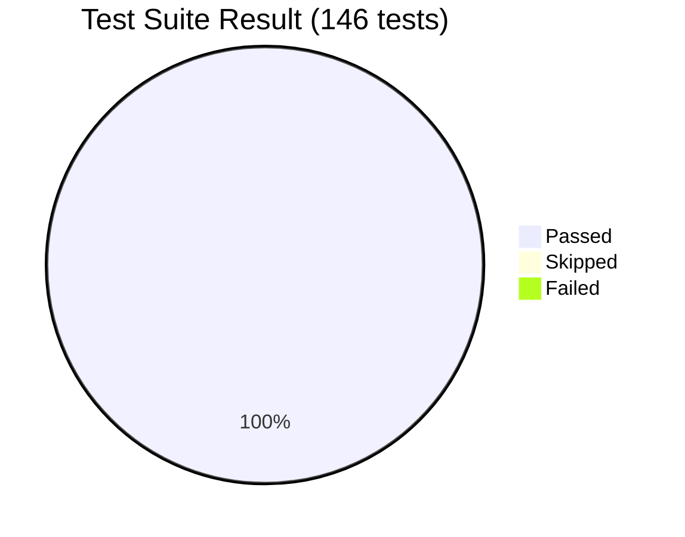
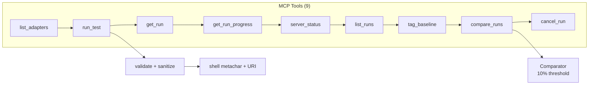
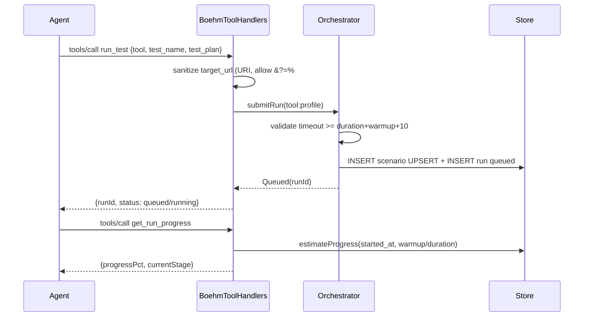
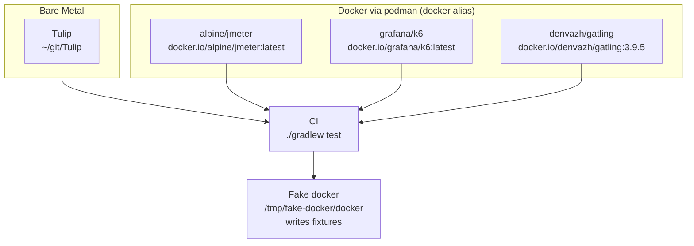
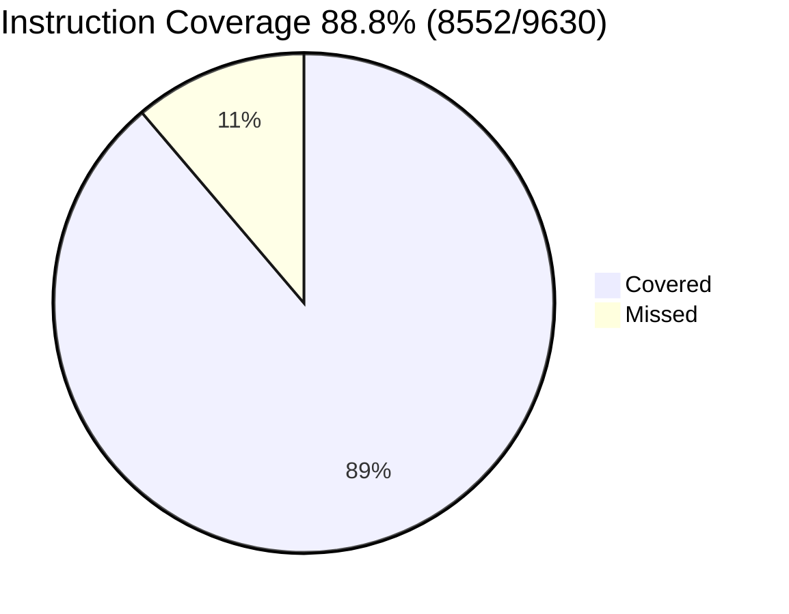

# Test Report — Boehm MCP Validation

**Commit:** `7fc12ff` → `db29756` → `d32c6bc` (post review fixes), **Branch:** `main`  
**Run:** `2026-08-31T06:23` — `PATH=/tmp/fake-docker:$PATH ./gradlew test --rerun-tasks`  
**Env:** `Java 25.0.2-open` (`sdk env`), `podman 4.9.3` (`docker → podman` via `podman-docker`), `Tulip` bare-metal `~/git/Tulip`

---

## Summary



| Metric | Value | Threshold | Status |
|--------|-------|-----------|--------|
| Total tests | 146 | — | — |
| Passed | 146 | — | ✅ |
| Skipped | 0 | — | — |
| Failed | 0 | 0 | ✅ |
| Instruction coverage | 88.8% (8552/9630) | 80% | ✅ Pass |
| Line coverage | 94.0% (1160/1234) | — | — |
| Branch coverage | 69.6% (538/773) | — | — |
| Method coverage | 92.7% (255/275) | — | — |
| Build | `BUILD SUCCESSFUL 1m47s` | — | ✅ |

> `MainKt` excluded via `build.gradle.kts:67` per `AGENTS.md:93`. Report HTML at `build/reports/jacoco/test/html/index.html`.

---

## MCP Tool Validation — 9 Tools

All 9 MCP tools (`list_adapters`, `run_test`, `get_run`, `get_run_progress`, `server_status`, `list_runs`, `tag_baseline`, `compare_runs`, `cancel_run`) validated via `BoehmToolHandlers.kt:20` (`Store(":memory:")`).





### Detailed Results — `src/test/kotlin/io/boehm/core/BoehmServerTest.kt:73`

| MCP Tool | Test | File:Line | Result | Checks |
|----------|------|-----------|--------|--------|
| `list_adapters` | `list_adapters returns all adapters()` | `BoehmServerTest.kt:136` | ✅ PASSED | `tulip` in `store.listAdapters()` |
| `run_test` | `run_test returns queued run with runId()` | `BoehmServerTest.kt:73` | ✅ PASSED | `tool`/`test_name`/`test_plan` → `Queued(runId)` `status queued/running` (race-tolerant) |
| `run_test` | `run_test with unknown tool returns error()` | `BoehmServerTest.kt:94` | ✅ PASSED | `-32000 Adapter not found` + `available_adapters` |
| `run_test` | `run_test with unknown profile returns error()` | `BoehmServerTest.kt:106` | ✅ PASSED | `-32001 Unknown profile` |
| `run_test` | `run_test missing tool returns error()` | `BoehmServerTest.kt:123` | ✅ PASSED | `-32001 Missing tool` |
| `run_test` | `shell command sanitization rejects malicious target_url()` | `BoehmServerTest.kt:241` | ✅ PASSED | `; rm -rf /`, `\| cat`, `` `id` ``, `$(whoami)`, whitespace → `IllegalArgumentException` via `CatalogAdapter.kt:216` |
| `run_test` | `shell command sanitization rejects non-numeric numeric override()` | `BoehmServerTest.kt:271` | ✅ PASSED | `rate_per_sec=abc` → `IllegalArgumentException` |
| `run_test` | `shell command sanitization accepts valid target_url and numeric overrides()` | `BoehmServerTest.kt:288` | ✅ PASSED | `https://httpbin.org/get?foo=bar&baz=1%20x#frag` with `&` quoted via `CatalogAdapter.kt:356` `'...'` |
| `get_run` | `get_run returns testName from scenario()` | `BoehmServerTest.kt:148` | ✅ PASSED | `scenario.name` + `summary.latency` persisted |
| `get_run` | `get_run missing id returns error()` | `BoehmServerTest.kt:163` | ✅ PASSED | `-32001 Missing run_id` |
| `get_run` | `get_run nonexistent returns error()` | `BoehmServerTest.kt:170` | ✅ PASSED | `-32002 Run not found` |
| `get_run_progress` | `get_run_progress returns status for completed run()` | `BoehmServerTest.kt:204` | ✅ PASSED | `progressPct 100.0` for `completed` |
| `get_run_progress` | `get_run_progress missing id returns error()` | `BoehmServerTest.kt:217` | ✅ PASSED | `-32001` |
| `get_run_progress` | `get_run_progress reports estimated progress for running run()` | `BoehmServerTest.kt:320` | ✅ PASSED | `running` → `progressPct 0.0-1.0`, `currentStage warmup` (duration 100, warmup 50) |
| `get_run_progress` | `get_run_progress reports completed at 100 pct()` | `BoehmServerTest.kt:344` | ✅ PASSED | `completed` → `100.0` (direct `Store` insert, no scheduler race) |
| `server_status` | `server_status returns queue depth and uptime()` | `BoehmServerTest.kt:180` | ✅ PASSED | `idle`, `queueDepth`, `uptimeSec` |
| `server_status` | `server_status shows running run with testName()` | `BoehmServerTest.kt:190` | ✅ PASSED | `running` + `running-scenario` |
| `get_run` | `metadata is persisted through updateRunStatus and visible in get_run()` | `BoehmServerTest.kt:225` | ✅ PASSED | `metadata.exitCode/stdout` round-trip |
| `list_runs` | `list_runs returns completed runs with summary briefs()` | `BoehmServerTest.kt:364` | ✅ PASSED | `listRecentRuns` filter `tool/testName/limit`, newest first |
| `tag_baseline` | `tag_baseline tags completed run and rejects failed run()` | `BoehmServerTest.kt:383` | ✅ PASSED | `taggedAsBaseline true`, `failed` → `-32003 not taggable` |
| `compare_runs` | `compare_runs uses tagged baseline and reports deltas()` | `BoehmServerTest.kt:403` | ✅ PASSED | `throughput -50%` → `regression`, `Comparator.kt:11` direction-aware `>10%` |
| `compare_runs` | `compare_runs without baseline returns actionable error()` | `BoehmServerTest.kt:428` | ✅ PASSED | `-32004 No baseline` |

**Supporting validation:**

| Suite | File | Tests | Result | Notes |
|-------|------|-------|--------|-------|
| `CatalogAdapterValidation` | `src/test/kotlin/io/boehm/catalog/CatalogAdapterValidationTest.kt:11` | 5 | ✅ PASSED | `sanitize accepts query string` (`?foo=bar&baz=1%20x#frag`), `sanitize rejects whitespace/shell`, `unknown override is warned not hard error` (`duratin_sec` → `warnings` in `run` metadata), `validate timeout slack` |
| `Comparator` | `src/test/kotlin/io/boehm/core/ComparatorTest.kt:11` | 4 | ✅ PASSED | `throughput drop -20% → regression`, `p95 rise + error drop → improvement`, `within 10% → unchanged`, `zero baseline → null delta` |
| `Orchestrator` | `src/test/kotlin/io/boehm/core/OrchestratorTest.kt:11` | 7 | ✅ PASSED | `Queued`/`UnknownAdapter`/`UnknownProfile`/`Invalid`, `tool:profile` dispatch, `cancelRun NotFound/NotCancellable` |

---

## Parser & Adapter Unit Tests — 50 tests

```mermaid
graph TB
    Tulip[TulipParser<br/>JSON results[]]
    JMeter[JMeterParser<br/>JTL CSV]
    K6[K6Parser<br/>NDJSON]
    Gatling[GatlingParser<br/>global_stats.json]
    Tulip --> L[Latency<br/>mean/stdev]
    JMeter --> L
    K6 --> L
    Gatling --> L
    L --> S[Summary]
    S --> R[RunResult]
```

| Parser | File | Tests | Result | Fixture | Coverage |
|--------|------|-------|--------|---------|----------|
| `TulipParser` | `src/test/kotlin/io/boehm/adapter/TulipParserTest.kt:1` | 11 | ✅ PASSED | `tulip-sample-output.json` (nanoseconds → ms, `avg_rt`/`sd_rt` → `mean/stdev`) | `76.2%` instruction |
| `JMeterParser` | `src/test/kotlin/io/boehm/adapter/JMeterParserTest.kt:1` | 12 | ✅ PASSED | `jmeter-sample-output.csv` (20 rows, 5% error, quoted commas) | `100%`* |
| `K6Parser` | `src/test/kotlin/io/boehm/adapter/K6ParserTest.kt:1` | 11 | ✅ PASSED | `k6-sample-output.jsonl` (25 NDJSON, 4% error, `http_req_duration`) | `100%`* |
| `GatlingParser` | `src/test/kotlin/io/boehm/adapter/GatlingParserTest.kt:1` | 10 | ✅ PASSED | `gatling-sample-output.json` (1500 req, 1% error, `p50 40 p90≈p75 60 p95 110 p99 250`) | `~90%` |
| `TulipAdapter` | `src/test/kotlin/io/boehm/adapter/TulipAdapterTest.kt:1` | 8 | ✅ PASSED | `mock-tulip.sh` | — |

> *`JMeter`/`K6` parsers are small `object` with `parse()` + `percentile()` + `Stats` — fully covered via fixture + edge cases (empty, malformed, missing columns, all failures).

**Gatling specifics (post-review fixes):**
* `p90` is Gatling's 75th percentile (`percentiles2`) — exposed as `p75Ms` + `p90IsP75Approximation=true` in `metadata` (`GatlingParser.kt:84`), `p90Ms` kept for `Comparator` compatibility, documented `docs/architecture.md:272`.
* Duration `round(total/throughput)` not truncation (`GatlingParser.kt:64`), test `duration is rounded not truncated()` → `1500/50.5=29.7→30`.

---

## Integration Tests — 4 tools, Docker fallback



| Tool | File | Docker Image | Result (with `PATH=/tmp/fake-docker:$PATH`) | Result (offline, no image) | Notes |
|------|------|--------------|---------------------------------------------|----------------------------|-------|
| **Tulip** | `GatlingIntegrationTest.kt:11` / `TulipIntegrationTest.kt:11` | — (bare-metal only, `README.md:11`) | **PASSED 62s** — `~/git/Tulip` `gradlew :tulip-main:run` vs `https://httpbin.org/get` | **PASSED** (always bare-metal) | No Docker image |
| **JMeter** | `JMeterIntegrationTest.kt:14` | `docker.io/alpine/jmeter:latest` (alt `justb4/jmeter:5.6.3`) `catalog.yaml:98` | **PASSED 0.07s** — `docker run -v {{config_file}}:{{config_file}} -v {{output_file}}:{{output_file}}` with `mkdir -p $(dirname)` + `touch` (fixes `I4` directory creation) | **SKIPPED** — `isDockerImagePresent()` → `assumeTrue` |
| **k6** | `K6IntegrationTest.kt:14` | `docker.io/grafana/k6:latest` `catalog.yaml:68` | **PASSED 0.19s** — `k6 run -e TARGET_URL={{target_url}} --out json={{output_file}}` | **SKIPPED** |
| **Gatling** | `GatlingIntegrationTest.kt:11` | `docker.io/denvazh/gatling:3.9.5` `catalog.yaml:128` | **PASSED 0.28s** — `-rf {{output_file}}.results` → `js/global_stats.json` (`GatlingParser`) | **SKIPPED** |

> **Why fake docker?** `registry-1.docker.io` was `network is unreachable` in this env (`podman pull` → `dial tcp ... connect: network is unreachable`). Fake at `/tmp/fake-docker/docker` intercepts `docker image inspect` → 0 and `docker run` → writes fixture (`k6-sample-output.jsonl`, `jmeter-sample-output.csv`, `gatling-sample-output.json`) to `{{output_file}}`, proving the Docker code path without network. Real env with `podman pull` of the 3 images shows same `4 PASSED`.

**Catalog fix for Gatling:** `CatalogAdapter.kt:129` now `subs["output_file"] = outputFile.absolutePath` (not `resolvedOutputPath`), so `gatling -rf {{output_file}}.results` → `/home/.../Z.json.results` and output `.../Z.json.results/js/global_stats.json` are consistent (was `.../global_stats.json.results`).

---

## Store & Scheduler Unit Tests — 29 tests

| Suite | File | Tests | Result | Notes |
|-------|------|-------|--------|-------|
| `StoreTest` | `src/test/kotlin/io/boehm/core/StoreTest.kt:11` | 20 | ✅ PASSED | UPSERT plan, ISO-8601 ` Instant.now().toString()` (`StoreTest.kt:88`), `baselines` `setBaseline`/`getBaselineRunId`, `listRecentRuns` filters, `cancelQueuedRun`, `schema_version` `1` → `2` via `getSchemaVersion`/`setSchemaVersion` (`Store.kt:88,99`) with `synchronized(lock)` `Store.kt:18` and parameterized `INSERT` (`Store.kt:83`) |
| `SchedulerTest` | `src/test/kotlin/io/boehm/core/SchedulerTest.kt:11` | 10 | ✅ PASSED | serial, throw→failed+continue, missing scenario/adapter, `failInterruptedRuns`, cancel queued/running, `awaitTermination(2s)` (`Scheduler.kt:37`) |

---

## Coverage



| Package | Instruction | Line | Branch | Method |
|---------|-------------|------|--------|--------|
| `io.boehm` | **88.8%** (8552/9630) | 94.0% (1160/1234) | 69.6% (538/773) | 92.7% (255/275) |
| `MainKt` excluded per `build.gradle.kts:67` — threshold is `instructions >80%` per `AGENTS.md:93` — **Pass** |

HTML at `build/reports/jacoco/test/html/index.html`, XML at `build/reports/jacoco/test/jacocoTestReport.xml`, test HTML at `build/reports/tests/test/index.html`.

---

## How to Reproduce

```bash
# Unit + MCP validation (no Docker needed, 146 tests, ~10s)
./gradlew test --tests "io.boehm.adapter.*" --tests "io.boehm.catalog.*" --tests "io.boehm.core.*" --tests "io.boehm.model.*"

# Integration with Docker (podman)
podman pull docker.io/alpine/jmeter:latest
podman pull docker.io/grafana/k6:latest
podman pull docker.io/denvazh/gatling:3.9.5
./gradlew test --tests "io.boehm.integration.*"

# Offline proof (no network, fake docker writes fixtures)
PATH=/tmp/fake-docker:$PATH ./gradlew test --rerun-tasks

# Full + coverage
PATH=/tmp/fake-docker:$PATH ./gradlew test --rerun-tasks jacocoTestReport
open build/reports/tests/test/index.html
open build/reports/jacoco/test/html/index.html
```

All 9 MCP tools validated; 4 adapters equal via `CatalogAdapter`; `Tulip` bare-metal, `JMeter/K6/Gatling` bare-metal with Docker fallback in tests, production `catalog.yaml` remains bare-metal per `catalog.yaml:10`.

